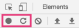
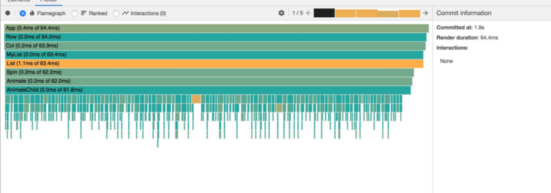
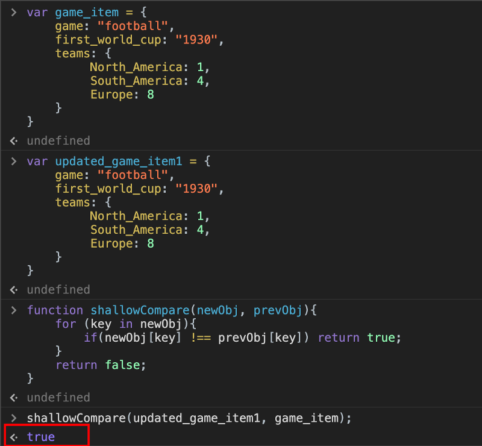

 on [flaticon](https://www.flaticon.com/).](./asset-1.png)

There are different ways of solving the same problem when it comes to programming — whether it be JavaScript, React, Python, or any other language. When you look into someone else’s code, there is always something new that you can learn.

React is evolving day by day and there are various approaches that can be used to solve any problem that we face in our application. Let’s look at ten tips and tricks that will definitely help you while working with React. Think of these tricks mostly as performance boosters for your application.

---

### **1\. Pause Console Debugger**

You have surely come across a scenario where you want to debug the style of dropdown or something else that closes automatically when you try to right-click on the element and click on “Inspect element.”

Here is a simple solution:

1.  Open your console from a browser.
2.  Type in the following command:

```
setTimeout(() => {debugger;}, 5000)
```

3\. Then open the dropdown that you want to debug.

Stop debugger — Credit: [ralex1993](https://twitter.com/ralex1993)

---

### 2\. useState Lazy Initialization With Function

There are times when we need to set the initial value of the state from some variable or from a function that returns a value.

Let’s take a look at the example below:

```
const initialState = someFunctionThatCaluclatesValue(props)

const [count, setCount] = React.useState(initialState)
```

Since our function is in the body, every time a re-render happens, this function is getting called even if its value is not required (we only need it during the initial render).

Let’s see how to lazy initialize `useState` with a function:

```
const getInitialState = (props) => someFunctionThatCaluclatesValue(props)

const [count, setCount] = React.useState(getInitialState)
```

Creating a function is very fast. React will only call the function when it needs the initial value (which is when the component is initially rendered). So even if the function is taking a lot of time, it will be slow on the initial render only. This is called “lazy initialization.” It’s a performance optimization.

Let’s look at this GIF to get an idea of what that looks like:


To play around with the example above:


---

### 3\. Making Use of Custom Hooks

With hooks, we don’t have some facility that can help us get the callback as in the case of `setState`.

For example, we get the callback in the state. Once the state is set, we usually use the callback function:

```
this.setState({
    "name" : "Harsh"
}, () => {
     // Hey that state is set successfully what do you
     // want to do, I'm callback your friend 😄
})
```

Let’s see how can we achieve similar behavior with a custom hook that gets called only when the state is changed and isn’t called during the initial render:

For more easy-to-understand hook recipes, check out [Gabe Ragland](https://twitter.com/gabe_ragland).

[**useHooks**  
_This hook makes it super easy to subscribe to data in your Firestore database without having to worry about state…_usehooks.com](https://usehooks.com/ "https://usehooks.com/")[](https://usehooks.com/)

---

### 4\. Monitor Unnecessary Renders in Your Applications

One of the common problems we face is evaluating the necessary renders in your application that are having a bad impact on the performance.

There are different ways we can evaluate them to avoid unnecessary renders in minutes

#### why-did-you-render

.](./asset-3.png)

According to its documentation, [why-did-you-render](https://github.com/welldone-software/why-did-you-render) “monkey patches React to notify you about avoidable re-renders.” This will display unnecessary renders that are happening in your application so that you can take action against them.

#### React Devtools

As noted by [DebugBear](https://www.debugbear.com/blog/measuring-react-app-performance):

> [“DevTools](https://chrome.google.com/webstore/detail/react-developer-tools/fmkadmapgofadopljbjfkapdkoienihi?hl=en) give us a visualization of the performance of your app. To see this, ensure that you are running React in development mode, open DevTools in your browser, and then go to the “Performance” tab.

> You can record the performance of your app from a point after the page has loaded or from the page load. There are two buttons in the top left corner of the DevTools dialog:”



Once you stop recording, you will be able to see a graph showing different components that rendered and the time taken to render them.



---

### 5\. Using React.memo and useMemo

According to [React's official documentation](https://reactjs.org/docs/react-api.html):

> "`React.memo` is a higher-order component.

> If your function component renders the same result given the same props, you can wrap it in a call to React. In some cases, memoizing the result will provide a performance boost. This means that React will skip rendering the component and reuse the last rendered result.”

`React.memo` does a shallow comparison out of the box and avoids rendering. A Stack Overflow user [defined a shallow comparison](https://stackoverflow.com/questions/36084515/how-does-shallow-compare-work-in-react) as being “when the properties of the objects being compared are done using `===` or strict equality and will not conduct comparisons deeper into the properties.”



_Note: In the example above,_ `_true_` _means that the component will render again despite the values being the same._

But there are times when you need to do a deep comparison, meaning you want to compare the nested properties in an array of objects. How can we do that? Let’s jump into our next trick.

---

### 6\. Deep Comparison in shouldComponentUpdate

As we saw in the example above, `React.memo` can only help you to avoid re-rendering if your values are simple. But if you have a nested array of objects, you cannot compare them right out of the box.

Use deep-equal:

[**deep-equal**  
_Node's assert.deepEqual() algorithm as a standalone module. This module is around 46 times faster than wrapping…_www.npmjs.com](https://www.npmjs.com/package/deep-equal "https://www.npmjs.com/package/deep-equal")[](https://www.npmjs.com/package/deep-equal)

Compare two objects and return whether they are equal according to a recursive equality algorithm.

> “If `opts.strict` is `true`, use strict equality (`===`) to compare leaf nodes. The default is to use coercive equality (`==`) because that's how `assert.deepEqual()` works by default.” — [deep-equal](https://github.com/inspect-js/node-deep-equal)

_Note: There are many such packages that can help you compare two nested arrays of objects to avoid re-rendering via comparison._

---

### 7\. React Window

Since most of the application has to do with rendering the data in the form of a list, when the list grows long, it’s like a poison is slowly entering your application and having a bad impact on the performance. It starts consuming a lot of memory in the browser as well. Since all the list items are in the DOM, there is a lag when you scroll the list.

How can we render only some parts of the items on the list that are currently visible on the screen then? Make use of React Window:

[**bvaughn/react-window**  
_React components for efficiently rendering large lists and tabular data React window works by only rendering part of a…_github.com](https://github.com/bvaughn/react-window "https://github.com/bvaughn/react-window")[](https://github.com/bvaughn/react-window)


No matter the size of your list (e.g. 1,000 items), it will only display 20–30 items in the DOM depending on the size of your window, which is completely customizable and will boost performance!

---

### 8\. React Query

With hooks for fetching, caching, and updating asynchronous data in React, managing server state is easier than ever before with React Query.

Here are the features listed on [GitHub](https://github.com/tannerlinsley/react-query):

-   Transport/protocol/back-end agnostic data fetching (REST, GraphQL, promises, whatever!)
-   Auto Caching + Refetching (stale-while-revalidate, Window Refocus, Polling/Realtime)
-   Parallel + Dependent Queries
-   Mutations + Reactive Query Refetching
-   Multi-layer Cache + Automatic Garbage Collection
-   Paginated + Cursor-based Queries
-   Load-More + Infinite Scroll Queries w/ Scroll Recovery
-   Request Cancellation
-   [React Suspense](https://reactjs.org/docs/concurrent-mode-suspense.html) + Fetch-As-You-Render Query Prefetching
-   [Dedicated Devtools (React Query Devtools)](https://github.com/tannerlinsley/react-query-devtools)


[**tannerlinsley/react-query**  
_Hooks for fetching, caching and updating asynchronous data in React Enjoy this library? Try the entire TanStack! React…_github.com](https://github.com/tannerlinsley/react-query "https://github.com/tannerlinsley/react-query")[](https://github.com/tannerlinsley/react-query)

---

### 9\. Lazy Loading React Components (With React.lazy and Suspense)

#### What is React.lazy( )?

As written by [Nwose Lotanna](https://blog.bitsrc.io/lazy-loading-react-components-with-react-lazy-and-suspense-f05c4cfde10c), `React.lazy` is:

> “A new function in React that lets you load React components lazily through code splitting without help from any additional libraries. Lazy loading is the technique of rendering only needed or critical user interface items first, then quietly unrolling the non-critical items later.”

#### What is Suspense?

> "`Suspense` is a component required by the lazy function that is basically used to wrap lazy components. Multiple lazy components can be wrapped with the help of the `Suspense` component. It also takes a fallback property that is going to accept the React elements you want to render as the lazy component is being loaded.” — [Nwose Lotanna](https://blog.bitsrc.io/lazy-loading-react-components-with-react-lazy-and-suspense-f05c4cfde10c)


See the code to play around with this on [CodeSandbox](https://codesandbox.io/s/react-lazy-suspense-n15rs).

You can now identify any large components on a page in your application that only render on certain user interactions (like clicking a button, toggle, etc). Splitting these components will minimize your JavaScript payloads and help you increase performance.

---

### 10\. One Function to Update Multiple Input State Values

This is the common use case of keeping the same function to update multiple input values. Most of us know about this approach that helps to reduce the code and get our job done. This is useful in case there are multiple inputs in a form:

---

### Conclusion

Did you know any of these tricks? Thanks for reading this article. I hope you learned something new!
