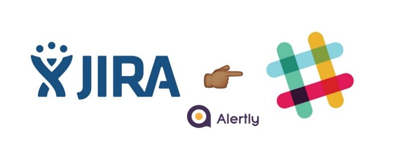
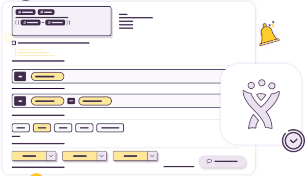
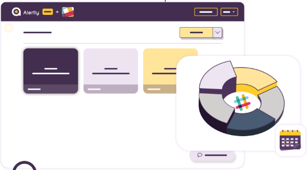
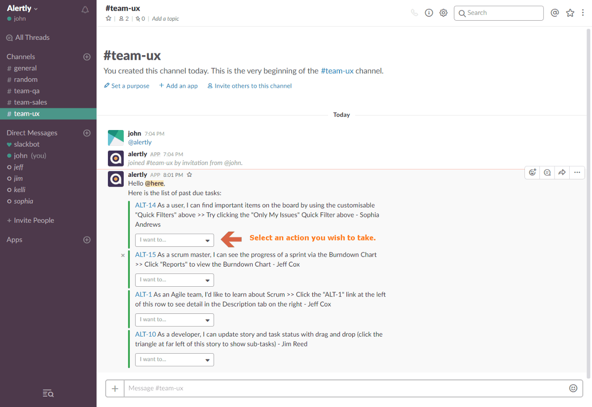
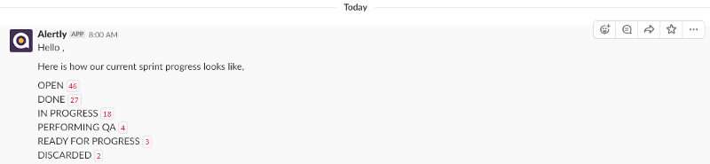

> Make your work fun again!

When it comes to people working together to build great software, the right tools can make all the difference. [**_Alertly_**](https://alertly.io/) provides you and your teammates with the ability to manage and work around JIRA alerts and complete tasks when due. Now, you can say goodbye to missing deadlines and dealing with tiny, annoying alerts as Alertly takes care of the whole task for you.

Here is a glimpse of the features which [**_Alertly_**](https://alertly.io/) provides 😀

---

### **Timely JIRA Reminders**

Be punctual. Be productive

Defining new filters will give you the freedom to create your own JIRA reminders. Alerts can also be created by providing additional details.

---

### Stay Updated

Send updates to every team member on slack so that your team members can move together towards achieving an objective.

---

### Custom Template

Your days of using the same message template for very single message are over. With Alertly, _you have the power to define a message template._

---

### Actionable Alerts

An actionable alert helps you solve JIRA issues right from your Slack account. It is powerful as it is effective.

---

### Marketplace Synchronization

Skip the stress of creating events from scratch with Alertly’s marketplace feature which allows you to add events from your Marketplace to your dashboard.

---

### Easy Team Management

Alertly makes team management incredibly easy. Every team leader gets updates from members regarding team progress and development.

Here are some previews from alertly

> **The Power to do More… Right at Your Own Convenience ✌️**

Know more about the features 🚀 — [https://alertly.io/#features](https://alerty.io/#/features)

[**Alertly - Your Personalized Slack Bot for JIRA Alerts**  
_Your days of using the same message template for very single message are over. With Alertly, you have the power to…_alertly.io](https://alertly.io/#features "https://alertly.io/#features")
