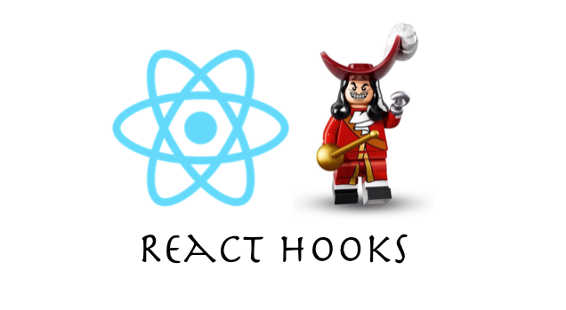
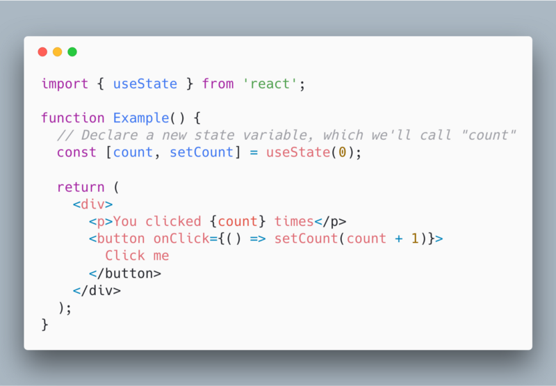
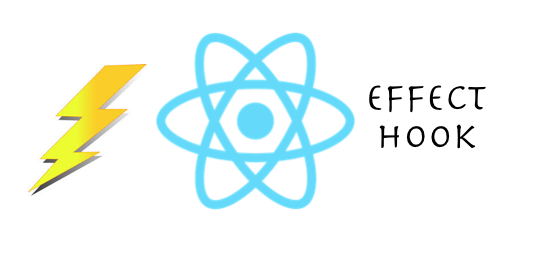

As the ReactJs library gets new updates, there are a lot of things being added and a few that are deprecated too. ReactJs is becoming more powerful day by day due to such updates. As a developer, you need to keep yourself up to date with new features coming out in every version.

#### Have you heard about React Hooks?

Well, React Hooks, a feature which is available in _React v16.7.0-alpha,_ is something awesome you should know about.

Here is a teaser for React Hooks.

In the above code, `useState` is the first Hook.

Now let’s jump into the problem that Reacts Hooks will be solving.

After all, every new feature is introduced to solve a problem. Here is the list of things that the [official react website](https://reactjs.org/docs/hooks-intro.html) has to say about the problems that will be solved.

#### It’s hard to reuse stateful logic between components

Reusable behavior cannot be attached to the React component. A good example of it could be connecting to the store. If you’ve some experience in React, you may be knowing some of the patterns like [render props](https://reactjs.org/docs/render-props.html) and [higher-order components](https://reactjs.org/docs/higher-order-components.html) that can be handy while solving such problems. Using such patterns, components have to be restructured in order to use them making code harder to follow and maintain.

With the introduction of Hooks, stateful logic can be extracted from the component. This allows it to be tested independently, and it can be reused.

> **_With Hooks, you can reuse stateful logic without actually changing your component hierarchy._**

#### Complex components become hard to understand

There are times when a component grows from having a small state to an unmanageable state of stateful logic.

Each lifecycle method sometimes contains a mix of unrelated logic. For example, a component might perform some data fetching via API calls in `componentDidMount` and `componentDidUpdate`. However, the same `componentDidMount` method might also contain some of the unrelated logic.

This logic sets up event listeners with cleanup performed in `componentWillUnmount`. Related code that changes together gets split.  
The unrelated code which is combined into a single method brings in bugs and inconsistencies.

We often come across a situation where we are not able to split a large component into smaller ones because of the stateful values. Also, it becomes difficult to test them.

To solve this problem, **Hooks let you split one component into smaller functions based on what pieces are related. A good example of it could be setting up a subscription or fetching data**, irrespective of code split based on the lifecycle method.

> **_With Hooks, more of React’s features can be used without the need for classes._**

### But how do Hooks really work?

Here is the code snippet we saw above:

[Link to CodeSandbox](https://codesandbox.io/s/lpokw8ox67)

The use of `useState` is the Hook that we are talking about.

We call it inside a function component to add a local state to it. React will preserve this state between all the re-rendering happening. `useState` returns a pair which has the _current_ state value and a function that lets you update the value.

You can call this function from an event handler or from somewhere else. It’s similar to `this.setState` in a React class, but it doesn’t merge the old and new state altogether.

There is only one argument to `useState` that is the initial state. In this example given above, the initial state is `0` because our counter starts from zero. Note that unlike `this.state`, the state here doesn’t have to necessarily be an object — however it can be an object if you want.

#### Declaring multiple state variables

The [array destructuring](https://developer.mozilla.org/en-US/docs/Web/JavaScript/Reference/Operators/Destructuring_assignment#Array_destructuring) syntax gives different names to the state variables which we declared by calling `useState`. These names don't belong to part of the `useState` API. Instead, React assumes that if you call a lot many times, you are doing it in the same order during the time of every render.

> **_Note:_** _Hooks are functions that let you “hook into” React state and lifecycle features from function components._ **_Hooks don’t work inside React classes_** _— they let you use React without classes._

### Effect Hook

Working with React you might have already worked on data fetching, subscriptions, or manually changing the DOM from React components. We call these operations as “side effects” (or “effects” in short).

The Effect Hook, `useEffect`, adds the ability to perform the side effects from a function component. It has the same purpose as `componentDidMount`, `componentDidUpdate`, and `componentWillUnmount` in React classes, but unified into a single API.

For example, the below component sets the document title after React updates the DOM:

[Link to CodeSandbox](https://wn8q6741xl.codesandbox.io/)

When you make a call to `useEffect`, you’re telling React to run your “effect” function after flushing changes to the DOM. Effects are declared inside the component and thus have access to its props and state. By default, React runs the effects after every render that happens— _including_ the first render.

### Rules of Hooks

Hooks are JavaScript functions, but they have two additional rules:

-   Only call Hooks **at the top level**. Don’t try to call Hooks inside loops, conditions, or nested functions.
-   Only call Hooks **from React function components**. Don’t try to call Hooks from regular JavaScript functions.

Well, this is a quick glance into React Hooks. For more detailed description follow this link below:

[**Hooks at a Glance - React**  
_A JavaScript library for building user interfaces_reactjs.org](https://reactjs.org/docs/hooks-overview.html "https://reactjs.org/docs/hooks-overview.html")

Happy Learning! 💻 😄
