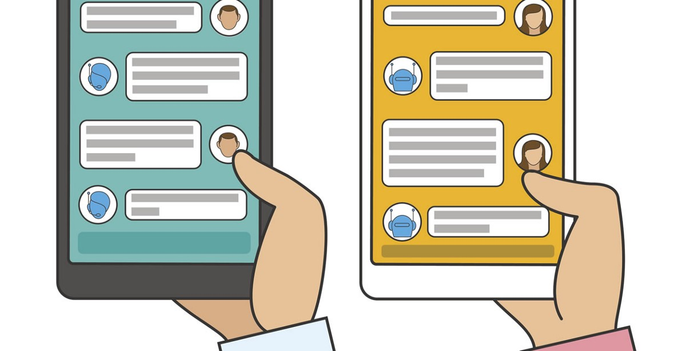
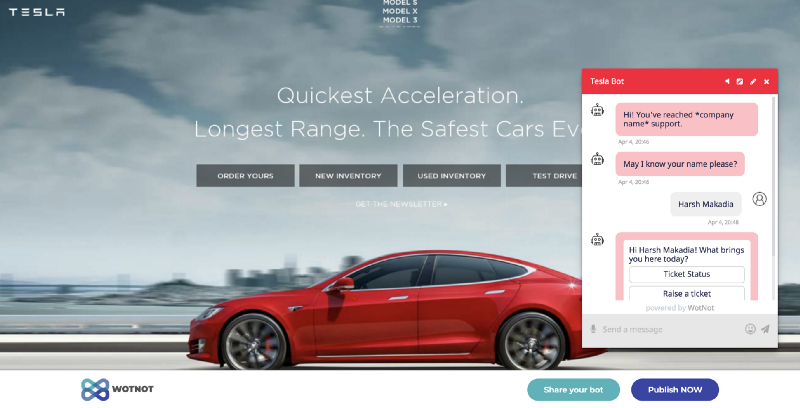

> **Yes, you heard it right!  
> Create your own chatbot and deploy them in minutes using Google Sheets. No extraordinary skills required.**

With the competition rising, creating chatbots is becoming easier more than ever. There are a lot of website which allow you to create chatbots easily.

[WotNot](http://wotnot.io) is a bot making platform that easily integrates with your website and you can fully customise the bot as per your business needs.

You can use [WotNot.io](http://wotnot.io) which allows you to create a chatbot for your website in no time. To differentiate them from the rest, they allow you to modify the conversation flow to the chatbot from a simple Google Sheets. And I’m sure there are not many people who don’t use Google Sheets.

Also, the data of the user interactions are stored in a Google Sheets, so that you can view the data in real-time and act accordingly.

---

[Here](http://wotnot.io) is a quick preview of how will the bot will look like on your website. Just enter you website URL and preview the prototype

---

Key Advantages of using WotNot.io

1.  **FAST ONBOARDING  
    **Have the Chatbot available on your website just by entering your website URL and start reaping the benefits right away. No time is spent on training or teaching employees.
2.  **READY TO USE TEMPLATES  
    **It provides ready to use default templates to make your work easier and then you can customize it according to your need
3.  **SALES BOOSTER  
    **Capable of remembering customer preferences and uses order history to suggest products, learns from customer responses to the products advertised and cross-sells effectively.
4.  **LEAD GENERATION  
    **The chatbot can ask the necessary and related questions, persuade the user and generate a lead for you. The technology of the Chatbot ensures the flow is in the right direction to get higher conversion rates.
5.  **MULTI LINGUAL  
    **Chatbots can solve your customer care problems in multiple languages round the clock. This allows your business to scale up the operations to new markets while simultaneously personalising the experience for your customers.
6.  **24/7 SUPPORT  
    **Think of it as an unremitting virtual robot committed to delivering a proactive conversational experience from the get go. Round the clock.

---

In conclusion, chatbots are the future. Everyone should be ready to integrate one with their business. With so many chatbot platforms at our disposal, it has become extremely easy to build a bot. It’s safe to say — **_a chatbot revolution coming_**.
