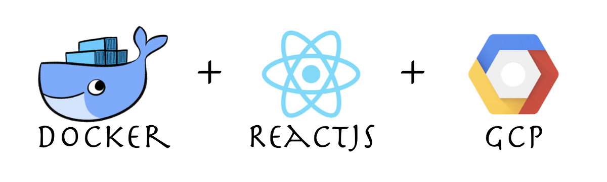

In this article, you will learn how to deploy applications on GCP. We will deploy a create-react-app.

Link to the Repo — [https://github.com/Harshmakadia/react-docker](https://github.com/Harshmakadia/react-docker)

Before we get started with the actual steps of deploying the React App using GCP and [Docker](https://hackernoon.com/tagged/docker). First, _let’s understand what docker actual is?_

Docker is a tool which is designed to make the creating, deploying and running of applications easier with the help of containers. Containers are something which allows the developer to bundle the application with all the necessary ingredients like different libraries, dependencies and ship is as only a single package.

We will go step by step

### 1\. Creating React Application

Create react app is a lot easier using the create-react-app (CRA)

We will use **_create-react-app_** package to install and configure simple react application from NPM, Open your terminal and install react app.

For more info on creating a react app

[**facebook/create-react-app**  
_Set up a modern web app by running one command. Contribute to facebook/create-react-app development by creating an…_github.com](https://github.com/facebook/create-react-app "https://github.com/facebook/create-react-app")[](https://github.com/facebook/create-react-app)

> once you run the application using command  
> $ npm start

> After that, it’s time to create a build the app, run  
> $ npm run build

### 2\. Creating minimal Dockerfile

creating a docker file is a cup of your tea. The is no rocket science in creating a docker file.

Just Create a new file with name **_Dockerfile  
_**Now once the file is created we will add some command to that which will help us to create, run, deploy the application.

Here the content of Dockerfile for react app. Note I’m using **_Nginx_** to as a server.

Dockerfile

Once the docker file is created. I’m creating a new folder named **deployment** within the app directory which has a **_nginx.conf_** file

The content of nginx file, note that this is default configuration you may not need to alter this file unless you have some special requirements.

nginx.conf

### 3\. **Installing Docker on your machine**

Head to this link below and download it for your respective operating system

[**Docker Desktop**  
_Docker Desktop Enterprise is a new commercial desktop offering that gives you everything you need for enterprise-ready…_www.docker.com](https://www.docker.com/products/docker-desktop "https://www.docker.com/products/docker-desktop")[](https://www.docker.com/products/docker-desktop)

Once it is installed run open your terminal and run below command to check it is installed successfully

> docker — — version

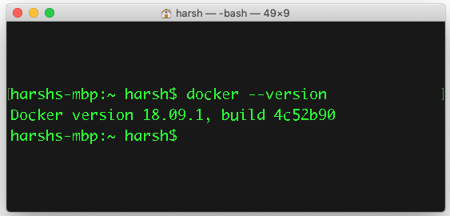

Now that we have the docker setup on our machine it’s time to create the first image using the following command

> docker build -t first-docker .

more info about different command can be found [here](https://docs.docker.com/engine/reference/commandline/build/).

Once you run this command it will execute all the command listed down in the Dockerfile.

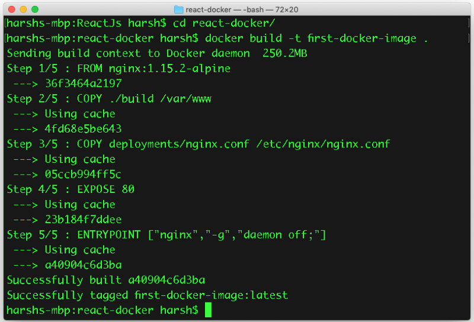

we have successfully created the image. Let’s proceed to next step

### 4\. Make use of gcloud SDK

Download SDK from the below link and setup on your machine

[**Cloud SDK | Cloud SDK | Google Cloud**  
_A collection of command line tools for the Google Cloud Platform. Includes gcloud, bq, gsutil and other important…_cloud.google.com](https://cloud.google.com/sdk/ "https://cloud.google.com/sdk/")[](https://cloud.google.com/sdk/)

Now that we have the gcloud SDK setup on our machine

#### \- — Create a new project in GCP

Next step is to create a new project in the GCP where we will be pushing our docker images to the containers.

Configure Docker to use `gcloud` as a credential helper or are using another [authentication method](https://cloud.google.com/container-registry/docs/advanced-authentication). To use `gcloud` as the credential helper, run the command:

-   `gcloud auth configure-docker`

It’s time to push the image to the registry

1.  Tag the local image with the registry name by using the command:

-   `docker tag [SOURCE_IMAGE] [HOSTNAME]/[PROJECT-ID]/[IMAGE]`

1.  where `[SOURCE_IMAGE]` is the local image name.
2.  This command names the image with the registry name and applies the tag `latest`. If you want to apply a different tag, then use the command:

-   `docker tag [SOURCE_IMAGE] [HOSTNAME]/[PROJECT-ID]/[IMAGE]:[TAG]`

### Push the tagged image to Container Registry

Push the tagged image to Container Registry by using the command:

```
docker push [HOSTNAME]/[PROJECT-ID]/[IMAGE]
```

This command pushes the image that has the tag `latest`. If you want to push an image that has a different tag, use the command:

```
docker push [HOSTNAME]/[PROJECT-ID]/[IMAGE]:[TAG]
```

When you push an image to a registry with a new hostname, Container Registry creates a storage bucket in the specified[multi-regional location](https://cloud.google.com/storage/docs/bucket-locations#location-mr). After pushing your image, you can:

-   Go to the [GCP Console](https://console.cloud.google.com/gcr) to view the registry and image.
-   Run `gcloud container images list-tags` to view the image's tag(s) and automatically-generated digest:
-   `gcloud container images list-tags [HOSTNAME]/[PROJECT-ID]/[IMAGE]`
-   The command’s output is similar to the following:
-   `DIGEST TAGS TIMESTAMP  
    44bde... test 2017-..-..`

#### Where

-   `[HOSTNAME]` is listed under **Location** in the console. It's one of four options: `gcr.io`, `us.gcr.io`, `eu.gcr.io`, or `asia.gcr.io`.
-   `[PROJECT-ID]` is your [Google](https://hackernoon.com/tagged/google) Cloud Platform Console [project ID](https://cloud.google.com/resource-manager/docs/creating-managing-projects#identifying_projects). See [Domain-scoped projects](https://cloud.google.com/container-registry/docs/overview#domain-scoped_projects) for how to work with projects IDs that include a domain.
-   `[IMAGE]` is the image's name in Container Registry.
-   `[TAG]` is the tag applied to the image. In a registry, tags are unique to an image.

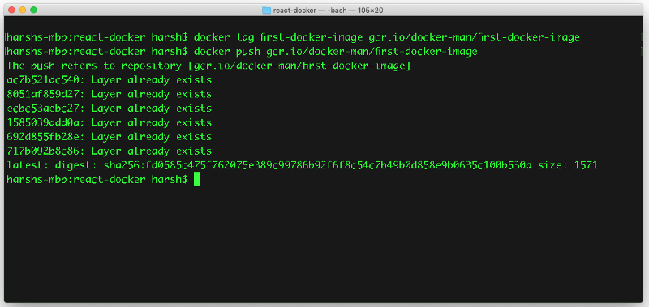

Navigate the GCP console and search of **_Container Registry,_** you will be able to see the image which we push.

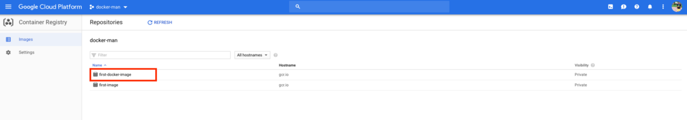

It’s time to create cluster now inside [**_Kubernetes Engine_**](https://cloud.google.com/kubernetes-engine/) in GCP

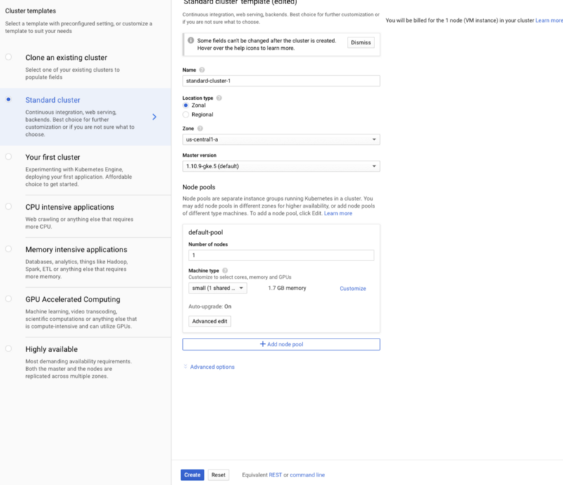

Create deployment under workloads

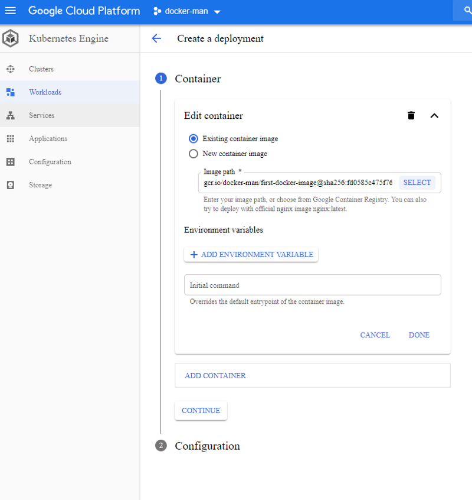

Select the image which you want to deploy and finally click on **_Expose_** to expose the deployment.

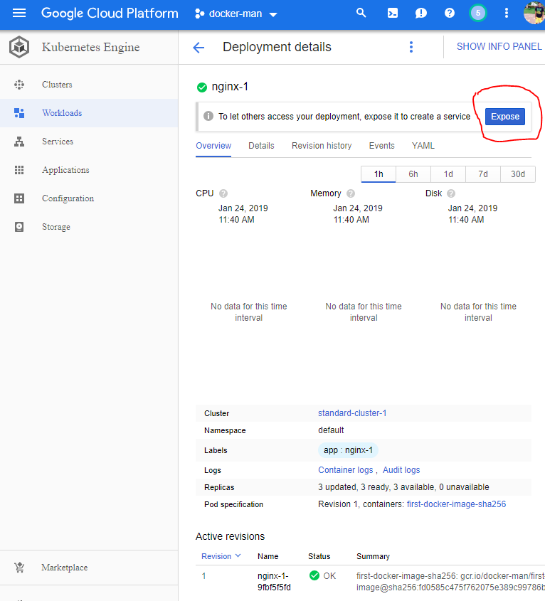

Set **_port to 80 in Target Port_** since we had EXPOSED our application to 80 in the Dockerfile

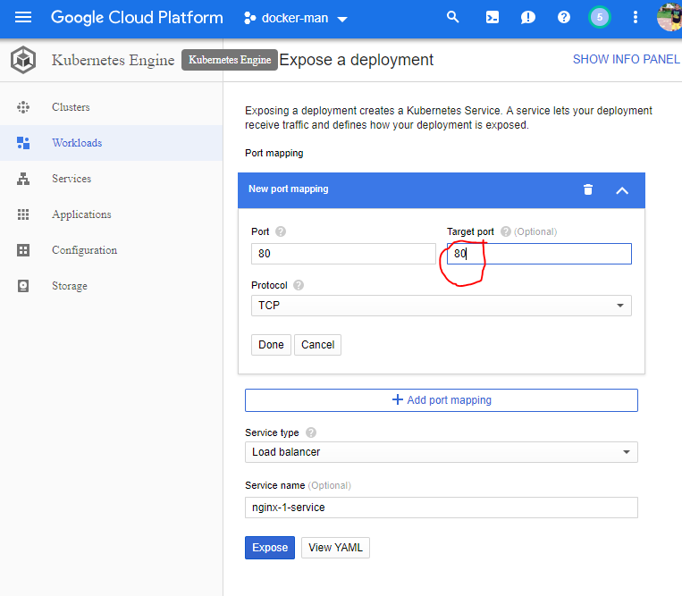

Once you have exposed the port you will get IP Adress where your react application will be running live.

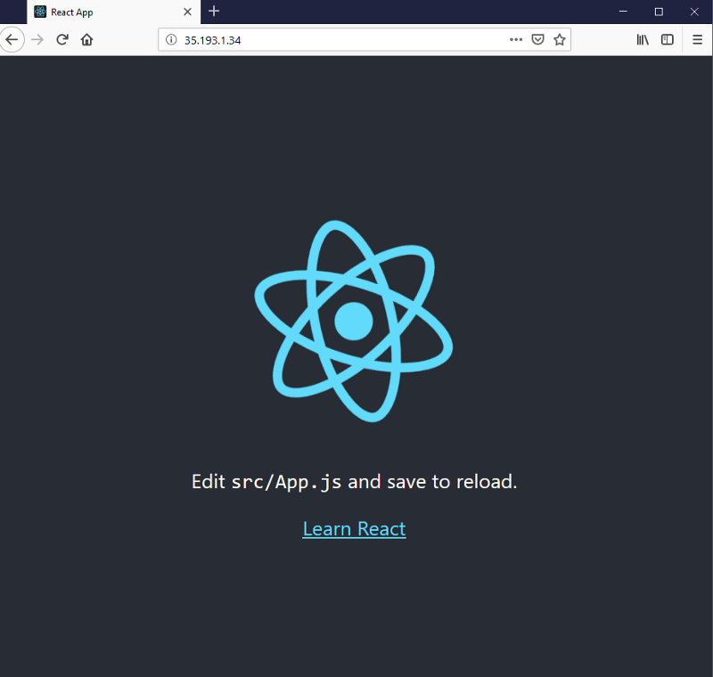

And that it’s you are all set with docker. Whenever you want to push new image to the container first build the image with above-specified commands and then push the image to container registry and finally make that image live by going to rolling update option.

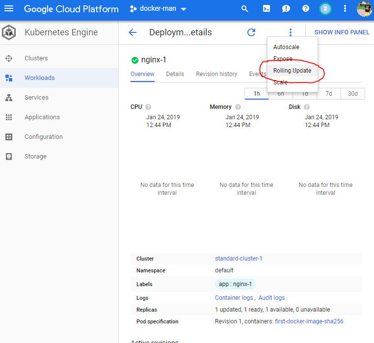

Please note down your questions in the comment section below if you have any doubts & I’ll be happy to address them.

That’s the end 🔚 I hope you have learned something new.   
Happy Learning! 💻 😃

<Embed src="undefined" aspectRatio={undefined} caption="" />
