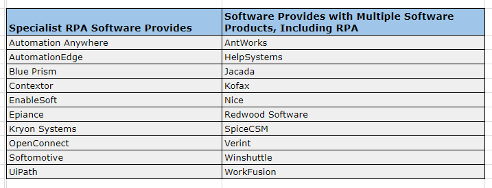

Robotic process automation (RPA) is the use of software with artificial intelligence (AI) and machine learning capabilities to handle high-volume, repeatable tasks that previously required humans to perform. These tasks can include calculations, queries, and maintenance of transactions and records.

RPA evolved from three key technologies: screen scraping, workflow automation, and artificial intelligence.

---

 (Robotics Process Automation)](./asset-2.png)

---

#### Benefits of using RPA —

-   Allowing processes to be completed much more rapidly saving human efforts
-   Creating cost savings for manual and repetitive tasks
-   Enabling employees to be more productive
-   Better customer service
-   Reduce manual data edits, increasing the quality of data and reducing compliance risks

#### Applications of RPA —

1.  **Data migration and entry -**  
    There are many companies where critical functions are still performed by the legacy systems. Let’s say legacy billing systems need to perform some task that cannot be done using API’s, instead of employees manually migrating the data RPA can prove to prevent such manual labor and potential clerical errors.
2.  **Extracting data from scanned documents, PDFs, and other formats -**  
    Optical Character Recognition, Screen scraping technologies enables extraction of data from almost any format.
3.  **Customer service -**  
    By automating contact center tasks which also includes scanned documents, verifying information RPA can help companies to offer a good customer service.
4.  **Human Resources -**  
    RPA can also automate many HR tasks which include on-boarding and off-boarding of the employee, updating employee information and many more
5.  **Healthcare -**  
    RPA can handle patient records, customer support, claims, reporting, billing and lot more for providing the better experience to the patients
6.  **Financial Services -**  
    Foreign exchange payments, managing audit, processing claims, opening and closing of accounts are some of the use cases in this sector
7.  **Supply Chain Management -**  
    In this sector, RPA can help in automating orders, processing and payments, generating reports of different departments.

#### Tools that can be used for RPA —

> **_So_me of the Links to different tools** —   
> Note that the names are based on the alphabetic order.

AntWorks ([www.ant.works](http://www.ant.works))

Automation Anywhere ([www.automationanywhere.com](http://www.automationanywhere.com))

AutomationEdge ([www.automationedge.com](http://www.automationedge.com))

Blue Prism ([www.blueprism.com](http://www.blueprism.com))

Contextor ([www.contextor.eu](http://www.contextor.eu))

EdgeVerve Systems ([www.edgeverve.com](http://www.edgeverve.com))

EnableSoft ([www.enablesoft.com](http://www.enablesoft.com))

Epiance ([www.epiplex500.com](http://www.epiplex500.com))

Jacada ([www.jacada.com](http://www.jacada.com))

Jidoka ([www.jidoka.io](http://www.jidoka.io))

Kofax ([www.kofax.com](http://www.kofax.com))

Kryon Systems ([www.kryonsystems.com](http://www.kryonsystems.com))

Nice ([www.nice.com](http://www.nice.com))

OpenConnect ([www.openconnect.com](http://www.openconnect.com))

Pegasystems ([www.pega.com](http://www.pega.com))

Redwood Software ([www.redwood.com/robotics](http://www.redwood.com/robotics))

Softomotive ([www.softomotive.com](http://www.softomotive.com))

Syntel ([www.syntelinc.com](http://www.syntelinc.com))

Thoughtonomy ([www.thoughtonomy.com](http://www.thoughtonomy.com))

UiPath ([www.uipath.com](http://www.uipath.com))

Verint ([www.verint.com](http://www.verint.com))

WorkFusion ([www.workfusion.com](http://www.workfusion.com))

> In Summary, RPA cannot be ignored based on the number of advantages it provides and it’s application considered in many industries. RPA is the future of automating the repetitive tasks.

---

