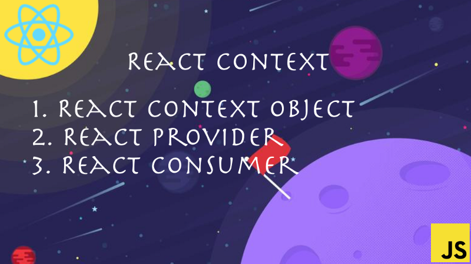

React has become a _fuzzword_ in front end development over the past few years. React is getting stronger and stronger with the new updates rolling out. This article will help you learn about React Context, which is a pure blessing for developers struggling with Data management between multiple components.

### Wait what does REDUX do?

Redux is an open-source JavaScript library for managing application state. It is most commonly used with libraries such as React or Angular for building user interfaces.

> In short, Redux helps to maintain a global state which can be accessed throughout the application.

Here is how typical redux works:

)](./asset-2.png)

Whoa whoa, that escalated quickly. What just happened? There are a lot of concepts to learn about in redux like **_Store, Action,_** and **_Reducers_**. But there is no need to learn all these things. You can do similar things with React Context. Wondering how?

### Introducing React Context

#### What is context?

Context provides an awesome way to pass data through the component tree without having to pass props down manually at every level in your application.

Until React 15, you could only make use of props to pass the values from the parent to the child component. But there is a lot beyond that: what do you do when you need to pass data between pages (different routes) within the application?

You have to either make use of redux or local storage, using cookies within the browser. Context solves all those problems. Context provides a way to share values like these between the components without having to explicitly pass a prop through every level of the tree within the application.

#### Context has 3 main blocks:

1.  [A context Object](https://reactjs.org/docs/context.html#reactcreatecontext)
2.  [A context Provider](https://reactjs.org/docs/context.html#contextprovider)
3.  [A context Consumer](https://reactjs.org/docs/context.html#contextconsumer)

Let’s try to solve a real-world scenario with context. Assume we want to create an application where products can be added to a cart. There are two pages (routes): one which displays the list of products, and the other which displays items in your cart.

If you were using only react without redux, it would become difficult to manage the state. We will look into how we can use **context** to manage the global state.

[**Live Demo**](https://react-context.netlify.com/)

)](./asset-4.gif)

The entire source code can be found [here](https://github.com/Harshmakadia/react-context-vs-redux).

As you can see in the about example, there are two different components and the data has to be shared among both the components — a kind of global data.

#### Context Object

You can define the Context object in a separate file or right next to a component in a component file if you wish. Having multiple contexts within the component is also possible. Thus you can store any data you want in the context object which will be accessed globally in your application.

I’ve added Products and cart in the context object. Now it’s time to supply this context to all the components in the application which need to access this data.

#### Context Provider

The provider provides the values in all the components within the application that needs to access this context object.

Providing Context

As shown above, this is how the context is passed. However, you can render any components within the   
**_<ShopContext.Provider></ShopContext.Provider>_**

> Whatever child component is wrapped inside the **ShopContext** will be able to access the context object.

Now that we have supplied the values, it’s time to access them with the consumer.

#### Context Consumer

There are two ways in which the data can be accessed:

1.  Using Context.Consumer
2.  Using static contextType

**Using Context.Consumer:**

Consuming Context

In the above example, the **_context_** is nothing but the values of the context object. All the values which we defined during creating the context object are easily accessed here. Yeah, it’s that easy!

#### Using static contextType

This is a simple way of how context can be accessed with contextType. Using **_this.context_** you can access the entire context object similar to that of context Consumer.

So far what we have seen in the example is about passing the data and accessing it. Let’s look into how to update the context Object.

#### Updating Context Object

Updating context state is pretty easy, like how we update the values in the state normally. We have to pass a method from the component which will be used to update the values in that state of context. Once the values are updated via setState, it will automatically render the new values in all the components where the context object is being consumed. No rocket science 🚀 here!

The above two methods are how we usually pass a function from the child component to parent component while working with React.

In the above code snippet, **_addProductToCart_** and **_removeProductFromCart_** are the two methods that will be used to add/update values inside the context.

### But will Context replace Redux 🤔?

-   Context is a clear win when you need to update the values rarely, like storing user objects upon login, language preference, theme colors and so on (as these do not trigger the updates more frequently)
-   Context seems to be simple compared to redux, but you shouldn’t use it where the values update more frequently. It is not optimized for that.
-   Adding Redux to your project brings more dependency packages with them, increasing the bundle size, while context can be used out of the box with React.

Thus from the above points, Context can definitely be used for low-frequency updates but is not recommended for general state management.

I hope in the coming updates that context becomes more powerful and is ready to fully use for state management 💪 🏋.

Happy Learning! 💻 😄
