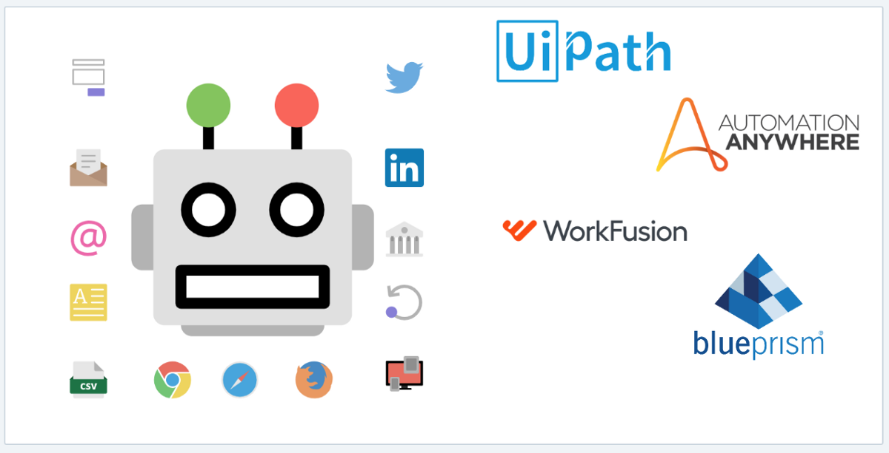
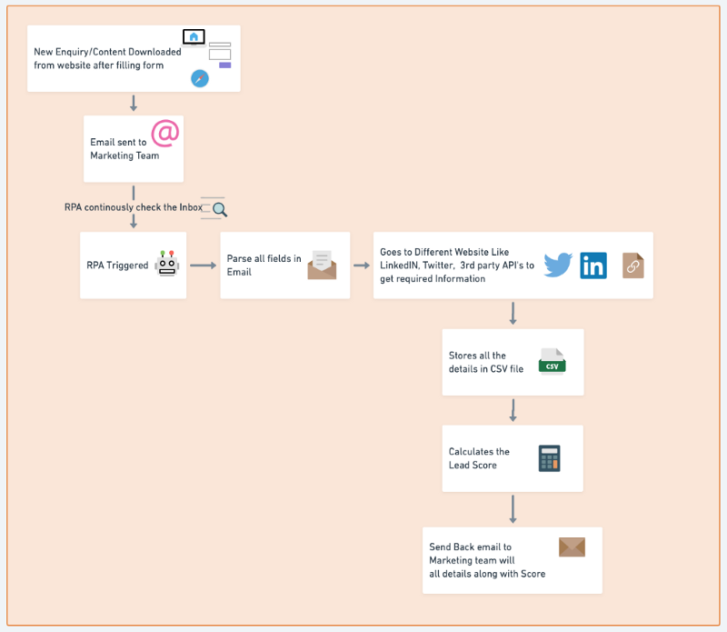
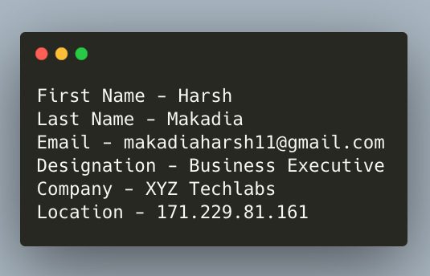
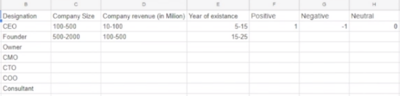
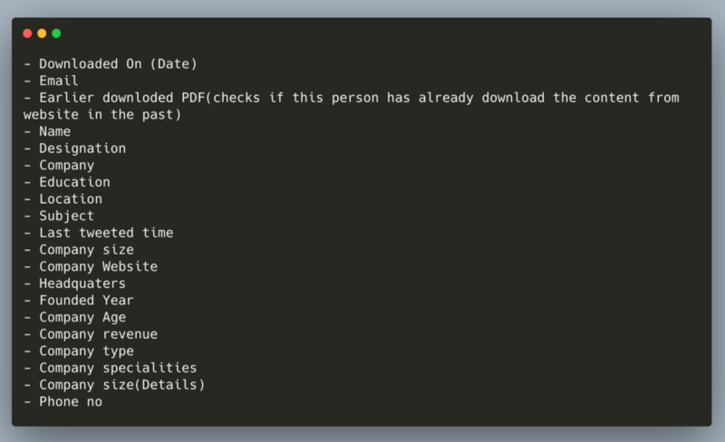

Robotic process automation (RPA) is the use of software with artificial intelligence (AI) and machine learning capabilities to handle repetitive tasks that previously required humans to perform.

RPA evolved from three key technologies: screen scraping, workflow automation, and artificial intelligence.

[**Fintech Startups are disrupting the Banking Industry around the World - Data Driven Investor**  
_Traditional brick & mortar banks have never really recovered from the major set back they received after the financial…_www.datadriveninvestor.com](https://www.datadriveninvestor.com/2018/10/20/fintech-startups-are-disrupting-the-banking-industry-around-the-world/ "https://www.datadriveninvestor.com/2018/10/20/fintech-startups-are-disrupting-the-banking-industry-around-the-world/")

> There are different tools available to perform automation like UiPath, Automation Anywhere, Blue Prism, WorkFusion and lot more.

### Lead scoring is a methodology used to rank prospects against a scale that represents the perceived value each lead represents to the organization.

Lead scoring helps the marketing team to prioritize the follow-up activities with the prospects. Here is a simple case study of how I automated lead scoring based on different types of factor to find out whether the lead is good enough to be approached using UiPath.

**Goal:**

> RPA performed to get all the details of the user who had downloaded content from the website Or filled up contact-us form. Automation performed to get details about the lead current position, year of experience company strength, revenue, location, etc to check if it is a hot lead.

Below diagram gives a quick overview of different steps involved in the automation in order to process the inbound lead.

Following steps were performed using robotics process automation

1.  When the user downloads some content from the website like e-book/case studies or fills up contact us form an email is received to the company with the basics details of the user like **_name, email address, designation_**.

2\. Lead scoring is nothing but giving a score to the user who downloaded the content from the website based on different factors like designation, company name, location, year of existence, company revenue, etc.

3\. A sheet with all the type of scoring details is giving as an input to find out the actual score.

4\. RPA robot reads email, parse all the required details

5\. Tries to find the LinkedIn profile of the user from the email address provided at the time of download.

6\. Get all the important details from the LinkedIn profile like education background, current job position, years of experience, location, company name

7\. Find the details about the company using LinkedIn to find out the employee strength, what is company expertise in doing

8\. Finds the details about the Twitter profile to check if twitter handle is active, gets last tweet time, followers and following of the handle

9\. Try to find out company revenue making use of third party website and gather necessary details

10\. Gather all these details in the CSV file to better understand about the lead

11\. Send emails back to the marketing team to take better decision on follow up emails etc.

Thus this is how RPA saved a lot of human time/effort that was required to process all the leads manually and take action. Now with the automation marketing team can spend their time in other productive tasks. This is just a small use-case of how things can be automated, However, RPA can be used in lot more complex scenarios too.

There is no doubt on this, Robotics Process Automation will be a blessing for all the businesses in the coming year saving a lot of time and human effort.

**_Welcome to the world of automation_**

Happy Learning 💻 😄

