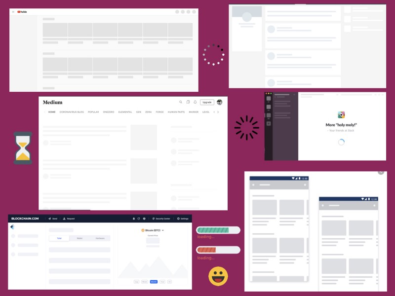

Nowadays many of the apps prefer content loading for better user experience let’s first find out what is skeleton loading?

](./asset-1.png)

#### Skeleton/Content Loading Screen

A skeleton screen is a version of the UI that doesn’t contain actual content/Information but it contains a mimics of how the page will look like when the actual content is displayed. It means that it will display the actual shape of how the layout will appear when all the information is loaded on the screen.

These screens usually content the place holder for different types of elements on the screens like text, images, videos, etc.

#### Advantages of Using Skeleton Screen

Instead of showing an old school loading mask at the center of your page where it is hard for the user to continuously keep staring at the loader, the skeleton screen will sometimes hide your performance issues 🤪 and the user is definitely going to enjoy watching the loading screen.

-   Content loader helps to mimic how your web/mobile app screen is going to look like even before loading
-   You can show loading for different types of elements like image, text, video or any other sections according to your content layout (A lot of tech companies display skeleton screens while their content loads to boost the UX.)
-   The goal is to design for a perception of decreased waiting time. Users if already aware of what’s next in the menu

Now in order to give you more idea about the loader in you are still not convinced let’s have a look at the example below



#### How to achieve this using React?

Good News, there are a lot of readily available packages that you can use out of the box. Below are some of the packages which you can try in your applications

-   [react-content-loader](https://danilowoz.com/create-content-loader/) (136,118 weekly downloads, 9K 🌟)
-   [react-loading-skeleton](https://github.com/dvtng/react-loading-skeleton) (54,298 weekly downloads, 1.3K 🌟)
-   [react-placeholder](https://github.com/buildo/react-placeholder) (22,808 weekly downloads, 1.2K 🌟)

### **Code Time ⚡️**

Now that we know the libraries which we can use to achieve such content loading let’s start looking at the code which we need to add in our application

#### Installation

```
npm i react-content-loader — save 

OR 

yarn add react-content-loader
```

#### Usage

1\. Using readily available presets

```
import ContentLoader, { Facebook } from 'react-content-loader'

const MyLoader = () => <ContentLoader />
const MyFacebookLoader = () => <Facebook />
```

2\. Custom mode, see the [online tool](https://danilowoz.github.io/create-react-content-loader/)

```
const MyLoader = () => (
 <ContentLoader viewBox=”0 0 380 70">
 {/* Only SVG shapes */} 
 <rect x=”0" y=”0" rx=”5" ry=”5" width=”70" height=”70" />
 <rect x=”80" y=”17" rx=”4" ry=”4" width=”300" height=”13" />
 <rect x=”80" y=”40" rx=”3" ry=”3" width=”250" height=”10" />
 </ContentLoader>
)
```

#### Demo Time 🧨


Sandbox credits — [https://codesandbox.io/u/shaunwallace](https://codesandbox.io/u/shaunwallace)

Link to codesandbox — [https://codesandbox.io/s/2wp1zoj09j](https://codesandbox.io/s/2wp1zoj09j)

Happy Learning! 😄 💻
