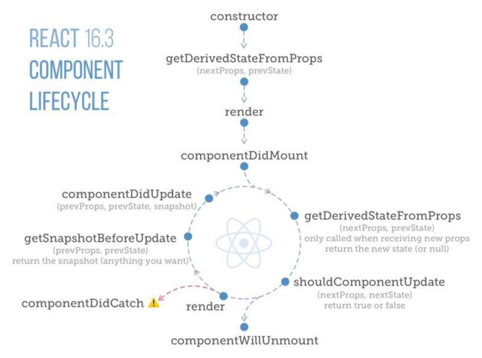
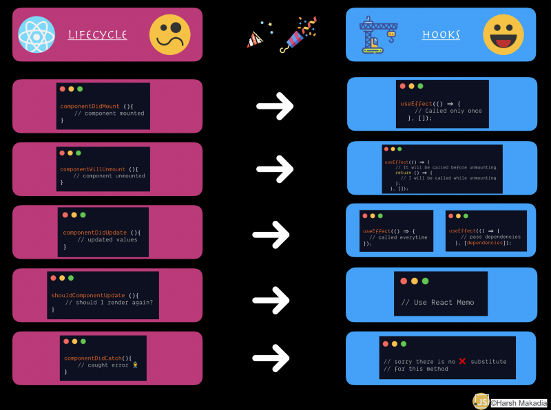

It’s been more than a year now since the release of Hooks. More devs are switching to Hooks implementation over classical class-based components. Even if the Hooks based implementation is difficult to understand at the beginning but it’s worth switching to Hooks at the end. 🎉

Before we start looking at the replacement method. Let’s look at the classic Lifecycle events which are used in React 16



Lifecycle Image credits — [https://twitter.com/dceddia](https://twitter.com/dceddia)

Let’s have a look at each one of them and how it can be replaced.

### componentDidMount( )

This method is usually called when the component has finished rendering for the first time. It is only called once throughout the lifecycle once after the component has finished mounting.

**_With Hooks:_**

```
function MyExample() {
  const [count, setCount] = useState(0);

  useEffect(() => {
    document.title = `You clicked ${count} times`;
  }, []); // Pass an empty array to run only callback on mount only.

  return (
    <div>
      <p>You clicked {count} times</p>
      <button onClick={() => setCount(count + 1)}>
        Click me
      </button>
    </div>
  );
}
```

---

### `componentDidUpdate( )`

This method is called multiple times which the app lifecycle. It is invoked immediately after updating occurs. This method is not called for the initial render.

There are two ways to handle,

1.  **Call hooks on every render**  
    As you can see if the below example the second argument in the hooks is blank meaning it will render every single time.

```
function MyExample() {
  const [count, setCount] = useState(0);

  useEffect(() => {
    document.title = `You clicked ${count} times`;
  }); // No second argument, so run after every render.

  return (
    <div>
      <p>You clicked {count} times</p>
      <button onClick={() => setCount(count + 1)}>
        Click me
      </button>
    </div>
  );
}
```

**2\. Call hooks when specific property (dependencies) are changed  
**With this implementation, we need to pass the second argument to useEffect and it will be automatically triggered whenever that dependency is changed.

**_With Hooks:_**

```
function MyExample() {
  const [count, setCount] = useState(0);

  useEffect(() => {
    document.title = `You clicked ${count} times`;
  }, [count]);

  return (
    <div>
      <p>You clicked {count} times</p>
      <button onClick={() => setCount(count + 1)}>
        Click me
      </button>
    </div>
  );
}
```

---

### ComponentWillUnmount( )

As the name implies this method will be called when the component is unmounted and it will be called only once in the component’s lifecycle.

**_With Hooks:_**Return a callback in `useEffect`'s callback argument and it will be called before unmounting.

```
function MyExample() {
  const [count, setCount] = useState(0);

  useEffect(() => {
    // It will be called before unmounting.
    return () => {
      console.log('componentWillUnmount!');
    };
  }, []);

  return (
    <div>
      <p>You clicked {count} times</p>
      <button onClick={() => setCount(count + 1)}>
        Click me
      </button>
    </div>
  );
}
```

---

### `shouldComponentUpdate( )`

By default this lifecycle method is called every time the component is going to render where you can return true/false whenever you have to render the component or avoid rendering.

But since Hooks can be only used in functional component, and functional component internally handles the shouldComponentUpdate( ) method for use. You can already achieve this on the component level using `React.PureComponent` or `React.memo`. For preventing rerendering of the child components.

**_With Hooks:_**By default, it will only shallowly compare complex objects in the props object. If you want control over the comparison, you can also provide a custom comparison function as the second argument.

```
import React from 'react'

function areEqual(prevProps, nextProps) {
  /*
  return true if passing nextProps to render would return
  the same result as passing prevProps to render,
  otherwise return false
  */
}

const Weather = ({weather}) => {
    return (<div>
             <p>{weather.city}</p>
             <p>{weather.temperature}</p>
             {console.log('Render')}
            </div>
    )
}

export default React.memo(Weather, areEqual)
```

---

### `getDerivedStateFromProps( )`

`getDerivedStateFromProps` is invoked right before calling the render method, both on the initial mount and on subsequent updates. It should return an object to update the state, or null to update nothing.

**_with Hooks:_**

```
function ScrollView({row}) {
  const [isScrollingDown, setIsScrollingDown] = useState(false);
  const [prevRow, setPrevRow] = useState(null);

  if (row !== prevRow) {
    // Row changed since last render. Update isScrollingDown.
    setIsScrollingDown(prevRow !== null && row > prevRow);
    setPrevRow(row);
  }

  return `Scrolling down: ${isScrollingDown}`;
}
```

Example reference — [https://reactjs.org/docs/hooks-faq.html#how-do-i-implement-getderivedstatefromprops](https://reactjs.org/docs/hooks-faq.html#how-do-i-implement-getderivedstatefromprops)

---

### **No Lifecycle method replacement**

Below are some of the methods that do not have any lifecycle method replacement for hooks according to the react documentation:

1.  **componentDidCatch ( )**
2.  **getSnapshotBeforeUpdate( )**
3.  **getDerivedStateFromError ( )**

---

Here is a quick preview of all methods together



Thanks for reading this article. I hope you are all geared up to start replacing the classical class-based components into hooks based implementation.

Happy Learning! 💻 😄

#### **A note from JavaScript In Plain English**

We have launched three new publications! Show some love for our new publications by following them: [**AI in Plain English**](https://medium.com/ai-in-plain-english), [**UX in Plain English**](https://medium.com/ux-in-plain-english), [**Python in Plain English**](https://medium.com/python-in-plain-english) — thank you and keep learning!

We are also always interested in helping to promote quality content. If you have an article that you would like to submit to any of our publications, send us an email at [**submissions@plainenglish.io**](mailto:submissions@plainenglish.io) with your Medium username and we will get you added as a writer. Also let us know which publication/s you want to be added to.
