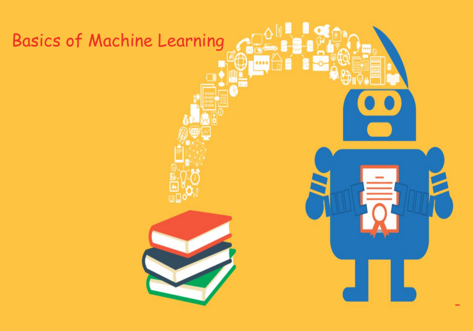

I’m sure every one of you must have heard of this _buzzword_ [Machine Learning](https://hackernoon.com/tagged/machine-learning). Wondering what it is. Let’s jump into its basics.

**Note**: This is just an overview to have quick knowledge about machine learning and how it is helpful.

M**achine learning** is an application of artificial intelligence (AI) that provides systems the ability to automatically learn and improve from experience without being explicitly programmed. **Machine learning** focuses on the [development](https://hackernoon.com/tagged/development) of computer programs that can access data and use it learn for themselves.

### Why Machine learning Matters?

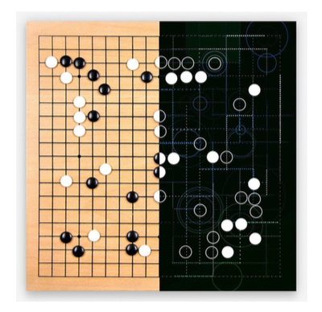

**AlphaGo** is a computer program that plays the board game Go. It was developed by Alphabet Inc.’s Google DeepMind in London.

AlphaGo defeated one of the best human players at Go — an extraordinary achievement in a game dominated by humans for two decades after machines first conquered chess.


**Dota** 2 is a multiplayer online battle arena (MOBA) video game developed and published by Valve Corporation

OpenAI reached yet another incredible milestone by defeating the world’s top professionals in 1v1 matches of the online multiplayer game Dota 2


**Google Translate** is a machine **translation** website from **Google** that can **translate** text between different languages. It can **translate** words, sentences, documents and web pages between any combination of more than 100 supported languages. It was launched on April 28, 2006, and has always been free to use.

> Artificial intelligence will shape our future more powerfully than any other innovation this century.

---

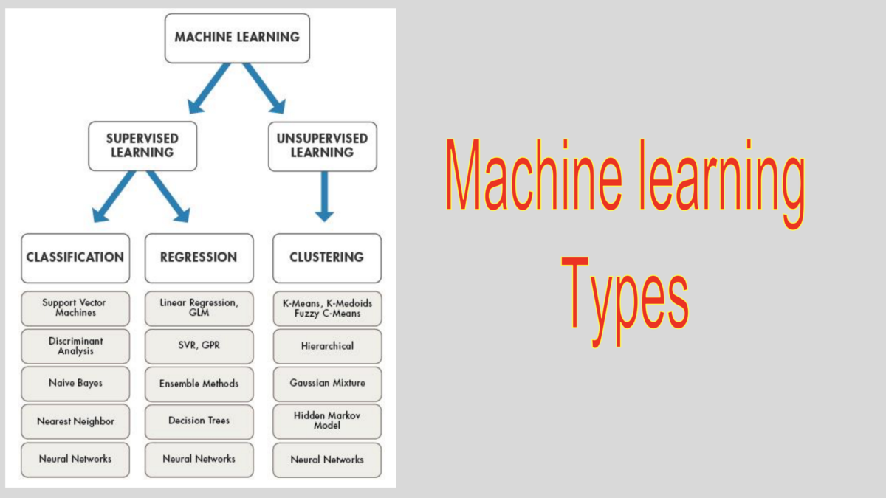

### Supervised Learning

Let’s look at the two task of supervised Learning

1.  Regression
2.  Classification

**_SUPERVISED LEARNING = DATA SET CONTAINING TRAINING EXAMPLES WITH ASSOCIATED CORRECT LABELS_**

Supervised Learning is a function that maps an input to an output based on example input-output pairs. It infers a function from labeled **training** data consisting of a set of **training** examples.

For example, learning to classify handwritten digits.

-   Train your data set to such extent that it becomes easy to find out the result of unknown inputs.

### How supervised Learning Works?

let’s examine the problem of predicting annual income of person based on the number of years of higher education he/she has completed.

Inshort,  
Build a model that approximates the relationship _f_ between the number of years of higher education X and corresponding annual incomeY

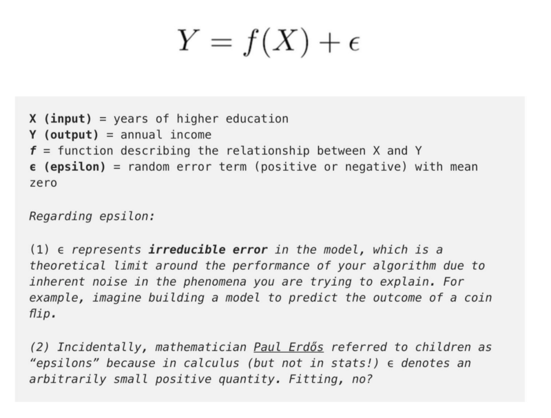

#### Solution

There are two ways you can find a solution

**Engineering Solution  
**This solution would go by simple formula

```
income = ($5,000 * years_of_education) + baseline_income
```

**Learning Solution  
**Get information about some basic parameters like Degree Type, Years of work experience, School tiers etc. This will helps use to find the income easily.

For example: _“If they completed a Bachelor’s degree or higher, give the income estimate a 1.5x multiplier.”_

### Goal of supervised Learning

-   Learns the relationship between income & education from _scratch_, by running labeled training data through a learning algorithm.
-   This learned function can be used to estimate the income of people whose income Y is unknown, as long as we have years of education X as inputs.
-   Inshort, we can apply our model to the **unlabelled** test data to estimate

> **Predict Y as accurately as possible when given new examples where X is known and Y is unknown**.

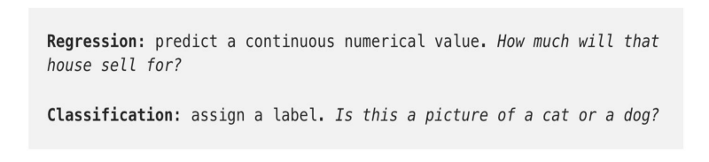

### **Regression — predicting continuous values**

— Predicts a continuous target variable Y.  
 — Estimate a value, such as housing prices or human lifespan, based on input data X.  
 — Continuous means there aren’t gaps (discontinuities) in the value that Y can take on. Eg. A person’s weight and height are continuous values.  
 — Discrete Variables means it can only take on a finite number of values Eg. Number of kids somebody has is a discrete variable.

> Predicting income is a classic regression problem. Your input data X includes all relevant information about individuals in the data set that can be used to predict income, such as years of education, years of work experience, job title, or zip code.

— These attributes are called **Features**, which can be numerical(e.g. years of work experience) or categorical (e.g. job title or field of study).

You’ll want as many training observations as possible relating these features to the target output Y, so that your model can learn the relationship _f_ between X and Y.

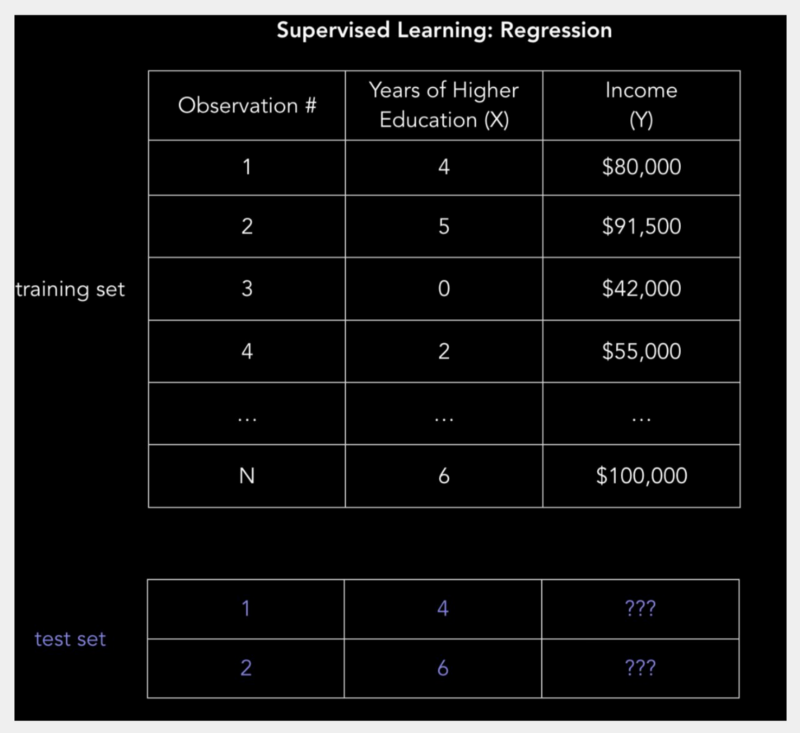

### Linear regression(ordinary least squares)

We have our data set X_,_ and corresponding target values Y. The goal of ordinary least squares (OLS) regression is to learn a linear model that we can use to predict a new _y_ given a previously unseen _x_ with as little error as possible. We want to guess how much income someone earns based on how many years of education they received.

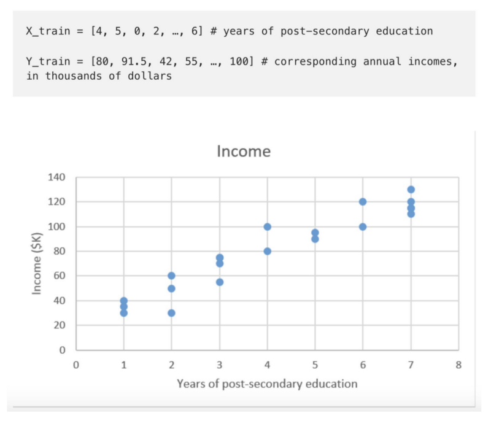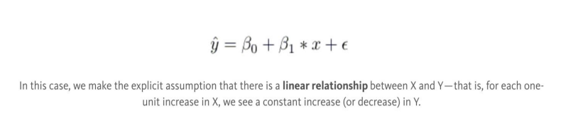

_β0_ is the y-intercept and _β1_ is the slope of our line, i.e. how much income increases (or decreases) with one additional year of education.

Our goal is to learn the model parameters (in this case, _β0_ and _β1_) that minimize error in the model’s predictions.

To find the best parameters:

1.  _Define a cost function, or loss function, that measures how inaccurate our model’s predictions are.  
     2. Find the parameters that minimize loss, i.e. make our model as accurate as possible._

---

### Classification

-   Classification predicts a discrete target label Y.
-   Classification is the problem of assigning new observations to the class to which they most likely belong, based on a classification model built from labeled training data.

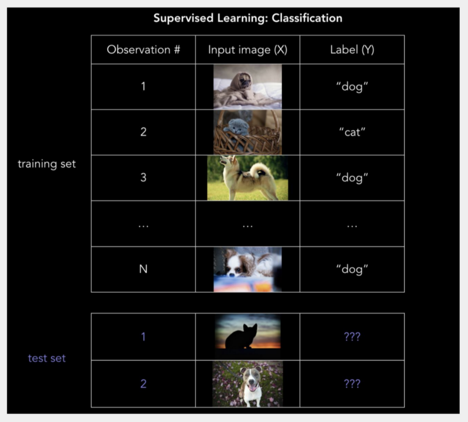

#### Logistic regression: 0 or 1?

Deals with binary type of classification

— example, when assigning handwritten digits a label between 0 and 9, or using facial recognition to detect which friends are in a Facebook picture.

**SVM (Support vector Machines)**

— The algorithm is **geometrically motivated** in nature, rather than being driven by probabilistic thinking.  
 — SVMs use a separating line (or, in more than two dimensions, a multi-dimensional hyperplane) to split the space into a red zone and a blue zone

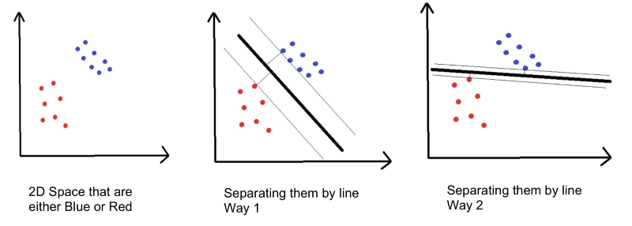

— The distance to the nearest point on either side of the line is called the margin, and SVM tries to maximize the margin.  
 — Think about it like a safety space: the bigger that space, the less likely that noisy points get misclassified.

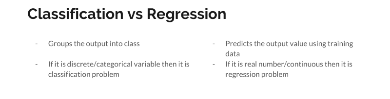

---

### Unsupervised Learning

**Unsupervised learning** is a type of **machine learning** algorithm used to draw inferences from datasets consisting of input data without labeled responses.   
The most common **unsupervised learning** method is cluster analysis, which is used for exploratory data analysis to find hidden patterns or grouping in data.

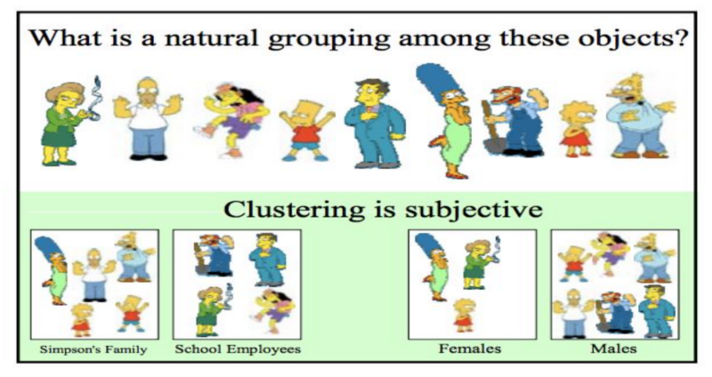

### Clustering

-   Items inside a **cluster** should be very similar to each other, but very different from those outside.
-   Does grouping of data without being told ahead of time
-   Used for knowledge discovery rather than prediction

— clustering is useful whenever there is diverse and varied data Famous clustering Method **k-means**

Now you know about the basics types in Machine Learning let’s have quick look at the difference between supervised and unsupervised learning.

---

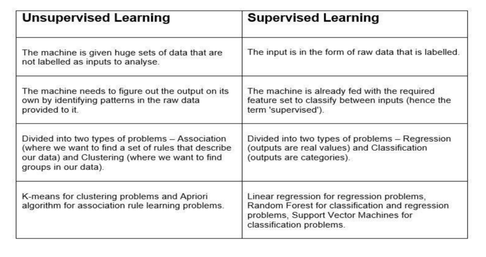

That’s it you are all good with the basics of Machine Learning.

Happy Learning! 😆 🖥


