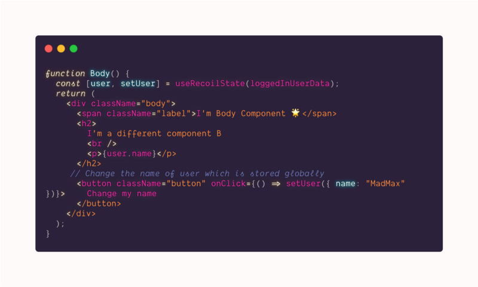

Recoil is an experimental state management library for React apps. It provides several capabilities that are difficult to achieve with React alone while being compatible with the newest features of React.

While working with react you might have noticed that are different ways to manage the global state management in React. Let’s take look at the options that we have:

#### Redux

Redux is a predictable state container for JavaScript apps.  
It is used by a lot of web apps these days, it allows us to have a global state, register components to it and they will re-render by themselves every time a value they registered to will change.

-   Redux helps you write applications that behave consistently, run in different environments (client, server, and native), and are easy to test.
-   Centralizing your application’s state and logic enables powerful capabilities like undo/redo, state persistence, and much more.
-   Redux works with any UI layer and has a large ecosystem of add-ons to fit your needs.

Read more about Redux — [https://redux.js.org/](https://redux.js.org/)

---

#### Context API

Context API is another approach that devs take for better management of state within the application.

Context is designed to share data that can be considered “global” for a tree of React components, such as the current authenticated user, theme, or preferred language.

-   Scalable from any range of application (small, mid, large)
-   Comparatively less complex than Redux
-   No need to pass data to the children at each level. Consumer component instance can access all the data provided by the Provider Component at any level.

Read more about context API — [https://reactjs.org/docs/context.html](https://reactjs.org/docs/context.html)

---

#### Recoil

Now that we are already using to above two famous ways of adding global state to our application here comes something new i.e **Recoil 🧨**

Recoil lets you create a data-flow graph that flows from atoms (shared state) through selectors (pure functions) and down into your React components.

-   **_Atoms_** are units of the state that components can subscribe to.   
    They’re updateable and subscribable: when an atom is updated, each subscribed component is re-rendered with the new value. They can be created at runtime, too. Atoms can be used in place of the React local component state. If the same atom is used from multiple components, all those components share their state.
-   **_Selectors_** transform this state either synchronously or asynchronously.  
    When these upstream atoms or selectors are updated, the selector function will be re-evaluated. Components can subscribe to selectors just like atoms, and will then be re-rendered when the selectors change.

#### Demo Time 🚀

Let’s try to understand this with a Demo example.

Consider we want to store user data upon login into our application and share between two components, <Header /> and <Body />. Let’s say if we were to do this with the **_useState_** hook we would have to define the useState Hook at both the places i.e inside the _Header_ and _Body_ component we cannot differently share the same state with useState Hooks. But with Recoil, we can easily achieve this.

Let first define an atom which stores the logged-in user Data

> **Note**: Don’t worry about the code snippet, I’ve got your back covered by adding the entire source code below.

In the above example, we have stored the object which has a _name_ in it. It is stored inside our _loggedInUserData_ atom.

Now consider we need to show this name in our **<Header />** component which looks something like this with help of **useRecoilState**

And our **<Body />** component looks something like this, which display the data from the same atom which is used in the header component again with help of **useRecoilState**

The syntax might look quite similar to **_useState_** which we are already used to in react hooks.

Now here’s the magic 🎩,  
As in the above example since the same state is shared between the   
**_<Header />_** component and the **_<Body />_** if you change the name of logged-in user from the **_<Body />_** component, then it will change it globally performing or necessary re-renders to update the state.

Here is a link to codesandbox for the code —

[https://codesandbox.io/s/react-recoil-ehfkd](https://codesandbox.io/s/react-recoil-ehfkd?file=/src/App.js)

There are some other terms that were not used in the demo but you should know about

#### useRecoilValue(state)

This is one of the important hooks in the Recoil API. This hook will just subscribe to the component to the given Recoil state, it is used to return the value of the given Recoil state.

#### Reference and links to learn

Recoil was announced at ReactEurope a few days back (14th May 2020) check about this video

[**facebookexperimental/Recoil**  
_Recoil is an experimental state management library for React apps. It provides several capabilities that are difficult…_github.com](https://github.com/facebookexperimental/Recoil "https://github.com/facebookexperimental/Recoil")

[**Recoil**  
_A state management library for React Recoil works and thinks like React. Add some to your app and get fast and flexible…_recoiljs.org](https://recoiljs.org/ "https://recoiljs.org/")

Thus this was a quick example of how recoil can be used to maintain the shared state within different components.

Happy Learning! 💻 😄

---

### Bit.dev | A Cloud Component Hub

Publish reusable React components from any codebase to a single component hub. Use [**Bit**](https://bit.dev/) to document, organize, and even keep track of component updates and usage.

Share components with your team to maximize code reuse, speed up delivery and build apps that scale.

[!Example: exploring React components published on [Bit.dev](https://bit.dev)](https://bit.dev)
