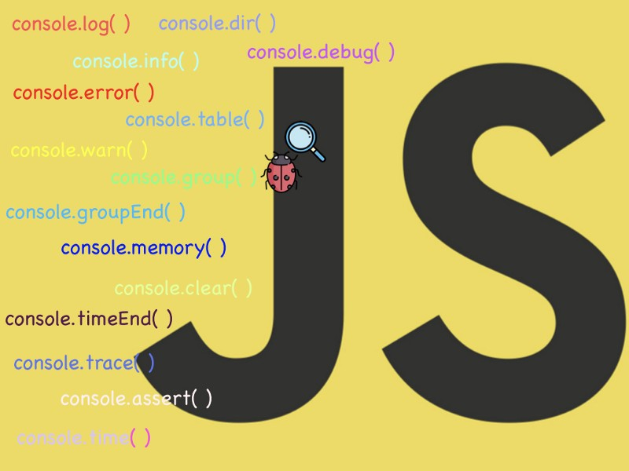

Printing messages in the browser console have definitely come to rescue to all the developers out there. c**_onsole.log( )_** messages are like medicines for most of your diseases while debugging some wired problems in your code.

Most of the devs out there are like — _Let’s print the message in the browser to know more about this issue_. I’m sure that I’m not the only one doing this. 🤪

> Debugging is like being the detective in a crime movie where you’re also the murderer — Filipe Fortes 🐛

Apart from the most commonly used console.log( ) message to print the message in the browser there are plenty of different ways to make your debugging process a lot easier. Let’s take a look at them one by one with examples.

### console.log( ) | info( ) | debug( ) | warn( ) | error( )

These will directly print the raw string with appropriate color based on the type of event that is provided to them.

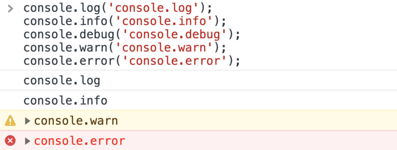

---

### Use placeholders

There are different placeholders that can be used as listed below  
**%o** — which takes an object,   
**%s** — which takes a string, and   
**%d** — which is for a decimal or integer

---

### Add CSS to console messages

Do all of your console messages look the same? well, it won’t be the same from now on, make your logs look more catchy for what matters the most to you.

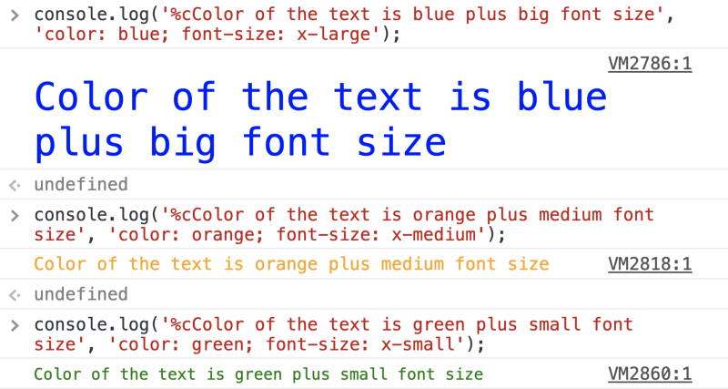

What to color only a specific word from the log message? Here you go 😄

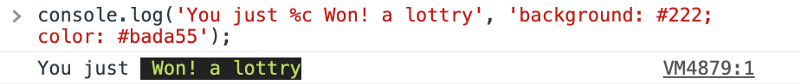

---

### console.dir( )

Prints a JSON representation of the specified object.

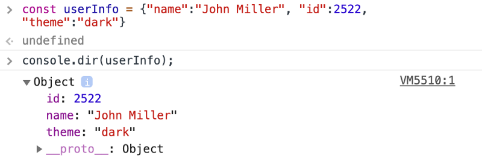

---

### HTML elements in console

Get the HTML elements in the console just like inspecting elements

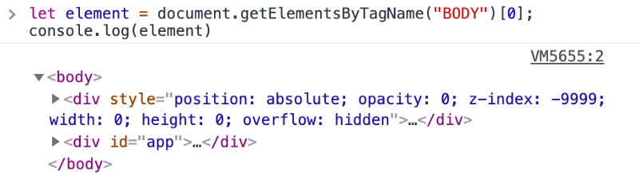

---

### console.table ( )

Want to view JSON in a proper and easily understandable way?

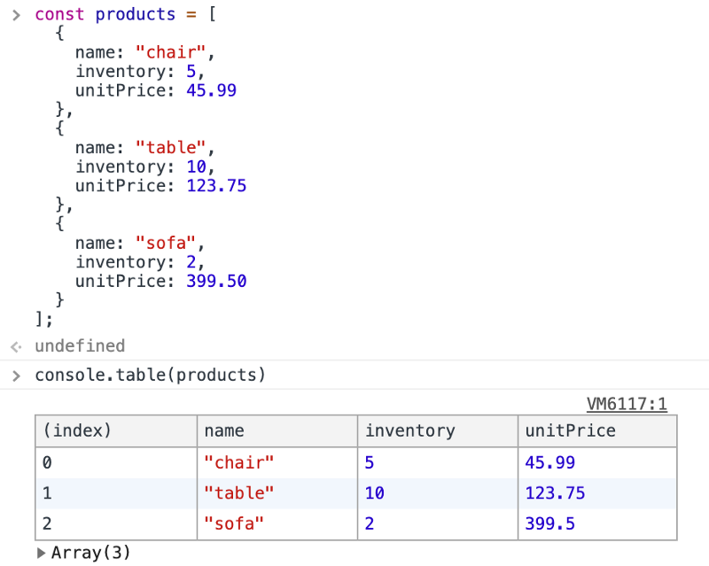

---

### console.group( ) & console.groupEnd( )

It is quite possible to group the messages with the console

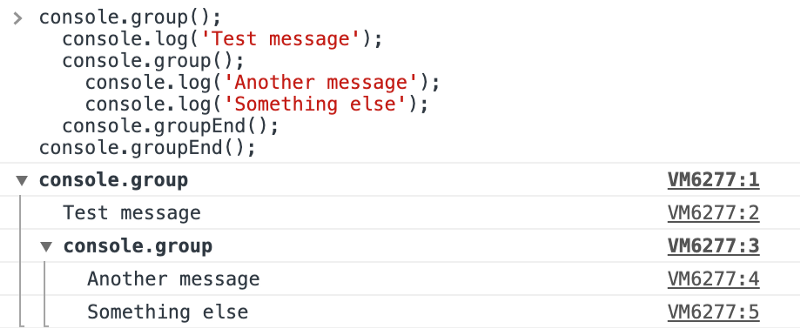

---

### console.count( )

This function logs the number of times that this particular call to `count()` has been called. This function takes an optional argument `label`.

If `label` is supplied, this function logs the number of times `count()` has been called with that particular `label`.

If `label` is omitted, the function logs the number of times `count()` has been called **at this particular line**.

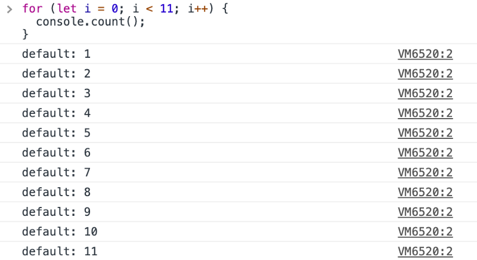

---

### console.assert( )

This comes quite handy when you only want to print some selected logs i.e. it will only print the false argument. It does nothing at all if the first argument is true.

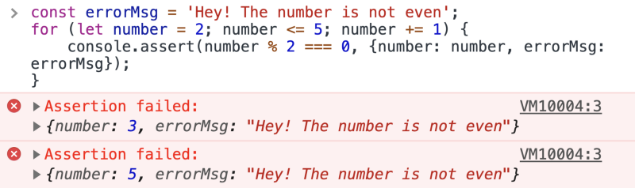

---

### console.trace( )

This method displays a trace that shows how the code ended up at a certain point.

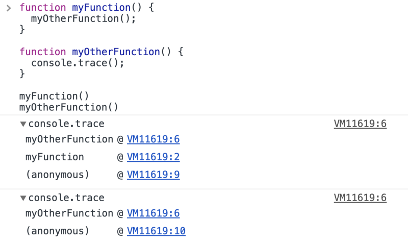

---

### console.time( )

A dedicated function for tracking the time taken for actions, console.time() is a better way to track the microtime taken for JavaScript executions.

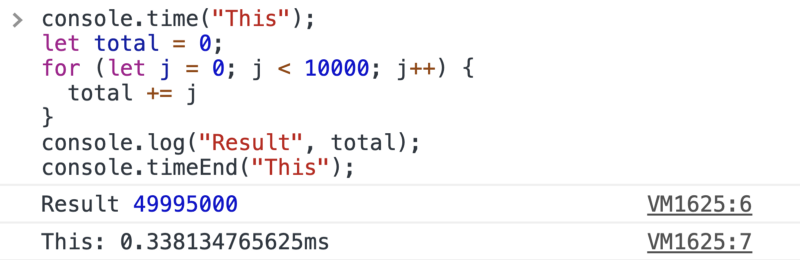

---

### console.memory( )

Wondering how our JavaScript applications are using browser memory?

---

### console.clear( )

This one is the last but not the least 😁, To clear all the above console messages which you’ve learned, It’s time to destroy them with clear() command

---

Here is the gist for all above snippets  
Link — [https://gist.github.com/Harshmakadia/fc25e56cb8f49145f4c9b3528f04215f](https://gist.github.com/Harshmakadia/fc25e56cb8f49145f4c9b3528f04215f)

gist

Happy Learning! 💻 😀
