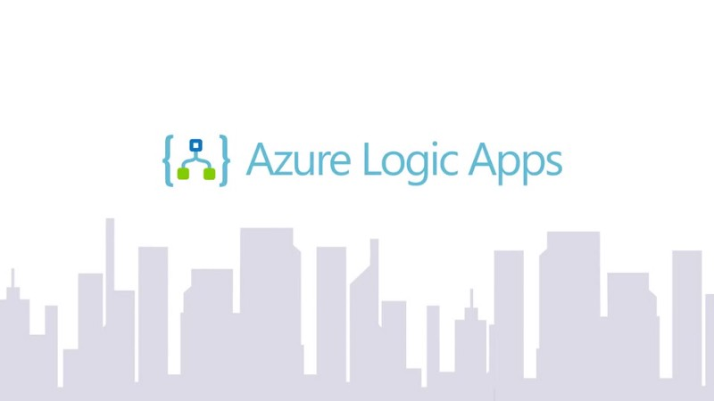
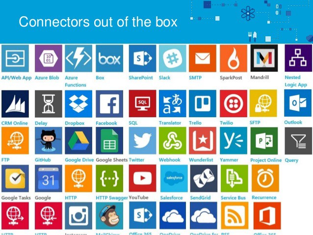
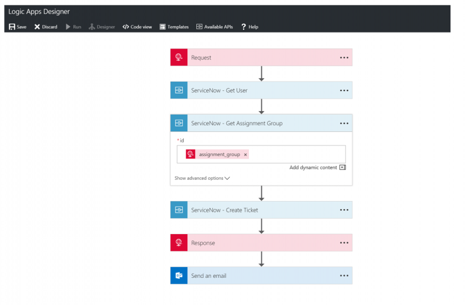

Wondering what are Azure Logic Apps? No worries I’ve got your back covered!

Azure Logic Apps is a cloud service that helps you automate and orchestrate tasks, business processes, and workflows when you need to integrate apps, systems, data, and services across enterprises or organizations. Logic Apps simplifies how you design and build scalable solutions for app integration, data/system integration, enterprise application integration, and business-to-business (B2B) communication, whether in the cloud, on-premises, or both.

**_Here are some of the examples where you could use Azure logics apps_**

1.  Send an email notification when something happens in your system, app or services
2.  Move files to Azure storage from SFTP or FTP servers
3.  Monitor the tweets on Twitter, perform sentiment analysis on them to create alert for the tweet which needs to be reviewed
4.  Change the logic in your app just with some toggles of the switch, no deployment of your entire codebase needed

> These are some of the benefits too, you will have more idea about it as you continue reading about it below.

Have a look at a quick video below

Enterprise integration solutions can be built with Azure logic Apps with the help of readily available **_connectors_**. Connectors play an integral part when you create automated workflows with Azure Logic Apps. By using connectors in your logic apps, you expand the capabilities for your on-premises and cloud apps to perform tasks with the data that you create and already have.

### Components of a Connector

Each connector offers a set of operations classified as ‘Actions’ and ‘Triggers’. Once you connect to the underlying service, these operations can be easily leveraged within your apps and workflows.

#### Actions

Actions are changes directed by a user. For example, you would use an action to look up, write, update, or delete data in a SQL database. All actions directly map to operations defined in the Swagger.

#### Triggers

Several connectors provide triggers that can notify your app when specific events occur. For example, the FTP connector has the OnUpdatedFile trigger. You can build either a Logic App or Flow that listens to this trigger and performs an action whenever the trigger fires

There are two types of trigger.

**Polling Triggers:** These triggers call your service at a specified frequency to check for new data. When new data is available, it causes a new run of your workflow instance with the data as input.

**Push Triggers:** These triggers listen for data on an endpoint, that is, they wait for an event to occur. The occurrence of this event causes a new run of your workflow instance.

---

Of course, it does come with a big box of benefits or rather why you should consider [using Azure Logic Apps.](https://spr.com/9-fantastic-reasons-for-using-azure-logic-apps/)

1.  **Create your own business process and flows visually  
    **A lot of business-oriented processes and system integration are out of box provided by the logic apps. They are executed in logical order starting from the trigger. The connector comes into handy to make all your task easy like sending email notification etc. The time to go live is really quick.
2.  **Wide Range of integration for the web, mobile apps, API apps and more**  
    Azure logic apps come as a single integrated service which is compatible with websites, mobile apps, APIs and business processes. Rest APIs and JSON help to easily connect over HTTP.
3.  **No scalability issues**  
    As everything is taken care of by azure you can meet the increasing demands from the client and customers. Delivering apps at a massive scale is just a cup of your tea.
4.  **No cost in setup**  
    Since the entire things are managed by Microsoft Azure logic apps there is no setup cost involved. You only pay when the logic is executed. It’s that simple.
5.  **Bonus — Increase in performance**  
    Creating logic is pretty simple since built-in-modules is there to rescue. It indirectly leads to faster delivery of projects to end user.
6.  **More insights through monitoring**  
    With the help of Azure Logic Apps, organizations can gain insights into the status of their applications. Logic Apps provides strong diagnostics and auditing with the help of Azure OMS (Operations Management Suite). Monitoring and tracking of the creation of custom queries on the data can be easily done. custom PowerBI report generation is also supported here.
7.  **Simplified Workflow definition**

> parameters, triggers, actions, outputs are the main parts of any logic apps.

**Parameters** are things that you want to reuse across workflows. Re-using values or even complex objects throughout the definition makes it easier to comprehend. Separate out configuration from the definition itself makes sharing easy as well as across different environments.

**Triggers** are what start the Logic App. Triggers can be evaluated at recurring intervals or have its state maintained across executions.

**Actions** are the things that happen in a Logic App. Actions can depend on other actions. The dependencies are what will determine the order of the Actions executing. The state is also maintained across executions.

**Outputs** are what gets sent from calls into the workflow.

---

I hope the basics of azure logic are clear and you are now ready to roll with the actual implementation. 😄

For more detailed understanding about azure logic apps here is the link

[**Azure Logic Apps Documentation - Tutorials, API Reference**  
_Azure Logic Apps simplifies how you build automated scalable workflows that integrate apps and data across cloud…_docs.microsoft.com](https://docs.microsoft.com/en-us/azure/logic-apps/ "https://docs.microsoft.com/en-us/azure/logic-apps/")

Happy Learning! 💻
