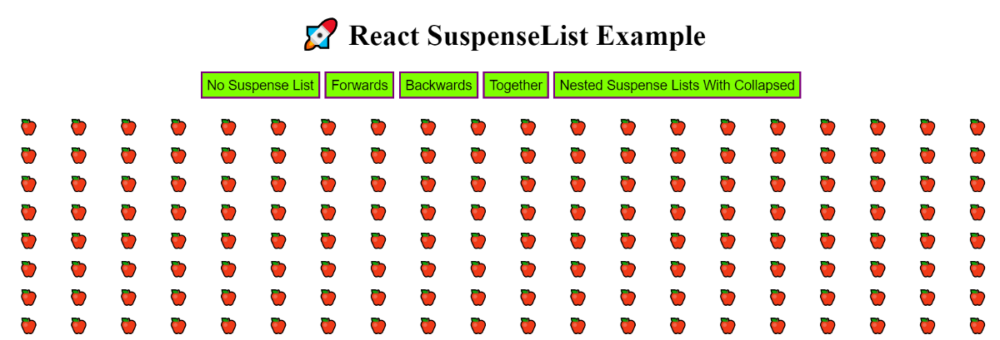
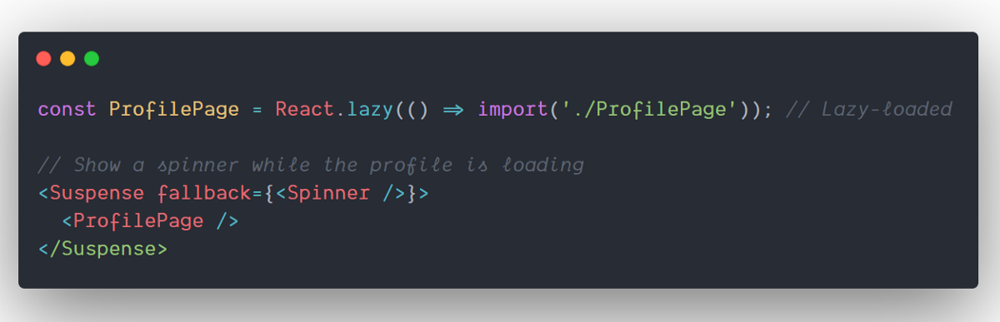
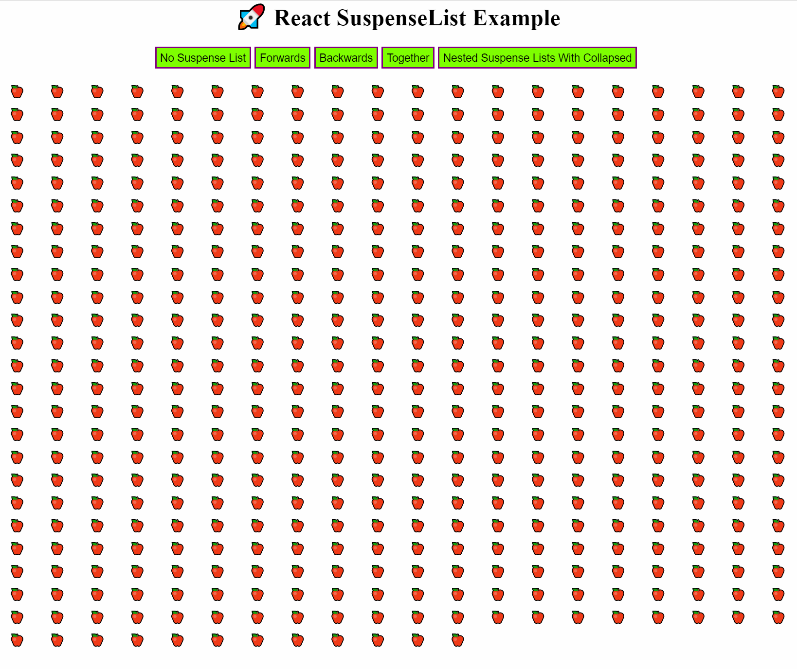

React 16.6 added a `<Suspense>` component that lets you “_wait_” for some code to load and declaratively specify a loading state (like a spinner) while waiting.

Here’s a quick glimpse of how the code looks:

Suspense for Data Fetching is a new feature starting from React 16.6 that lets you use `<Suspense>` to **explicitly “wait” for, well, anything.** It can wait for images, scripts, or other asynchronous work along with Data Fetching.

### SuspenseList

SuspenseList helps coordinate many components that can be suspended, by orchestrating the order in which these components are revealed to the user.

`SuspenseList` takes two props:

-   **revealOrder (forwards, backwards, together)** defines the order in which the `SuspenseList` children should be revealed.
-   `together` reveals _all_ of them when they’re ready instead of one by one.
-   **tail (collapsed, hidden)** dictates how unloaded items in a `SuspenseList` are shown.
-   By default, `SuspenseList` will show all fallbacks on the list.
-   `collapsed` shows only the next fallback on the list.
-   `hidden` doesn’t show any unloaded items.

In short, `SuspenseList` can be used to load items, on at a time, in a defined order, or all together — for better user experience.

We can wrap multiple `<Suspense/>` inside `<SuspenseList/>` Tag.

---

Let’s Deep dive into the Demo example:

In the above example, there is a div that displays a **loader**( ⌛️ ) until the **apple** ( 🍎 )emoji is loaded.

I’ve added a random **setTimeout** ( 🕰 ) to make the apple load at different time intervals. Thus the above example shows how we can use different props of SuspenseList to load items inside it according to our requirements.

---

> ⚠️ SuspenseList is experimental feature that are [not yet available](https://reactjs.org/docs/concurrent-mode-adoption.html) in a stable release. Don’t rely on experimental builds of React in production apps. These features may change significantly and without a warning before they become a part of React.

#### Link to Sandbox

**🔥Live Demo:**

[**React App**  
_Edit description_n3818.csb.app](https://n3818.csb.app/ "https://n3818.csb.app/")

**🚀 Github Code:**

[**Harshmakadia/react-suspenseList**  
_Demo example for suspense list ⚠️ SuspenseList is experimental feature that are not yet available in a stable release…_github.com](https://github.com/Harshmakadia/react-suspenseList "https://github.com/Harshmakadia/react-suspenseList")

#### Link 🔗 to Suspense Documentation —

[**Suspense for Data Fetching (Experimental) - React**  
_Caution: This page describes experimental features that are not yet available in a stable release. Don't rely on…_reactjs.org](https://reactjs.org/docs/concurrent-mode-suspense.html "https://reactjs.org/docs/concurrent-mode-suspense.html")

Happy Learning! 😄 💻

### Learn More

[**How to Share React UI Components between Projects and Apps**  
_A simple guide to help you easily share and reuse React components across apps, to build faster and better._blog.bitsrc.io](https://blog.bitsrc.io/how-to-easily-share-react-components-between-projects-3dd42149c09 "https://blog.bitsrc.io/how-to-easily-share-react-components-between-projects-3dd42149c09")

[**9 React Libraries and Tools to Master your Component Workflow**  
_9 React UI component libraries and tools to speed your workflow._blog.bitsrc.io](https://blog.bitsrc.io/9-tools-and-libraries-to-boost-your-react-component-workflow-6ff4b49511c2 "https://blog.bitsrc.io/9-tools-and-libraries-to-boost-your-react-component-workflow-6ff4b49511c2")

[**5 Ways to Style React Components in 2019**  
_Making sense of styling React components in 2019 in a short yet detailed review_blog.bitsrc.io](https://blog.bitsrc.io/5-ways-to-style-react-components-in-2019-30f1ccc2b5b "https://blog.bitsrc.io/5-ways-to-style-react-components-in-2019-30f1ccc2b5b")
