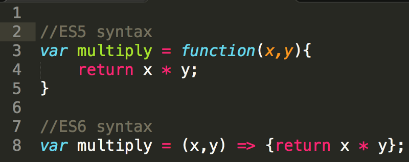
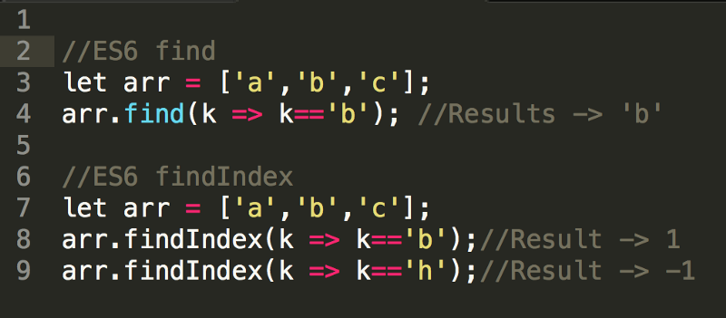
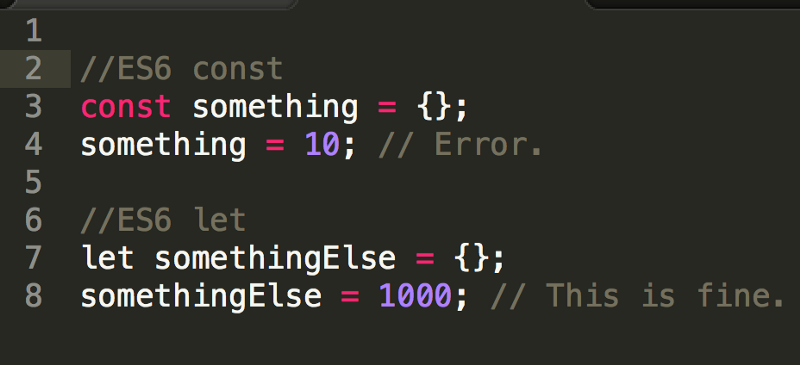
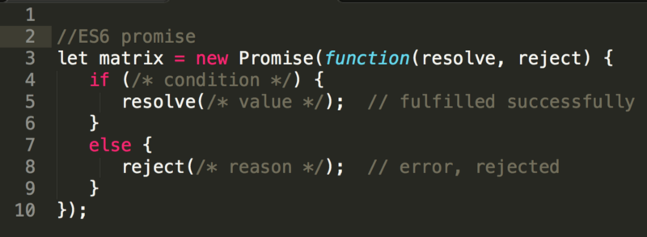
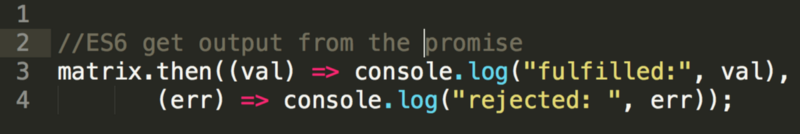
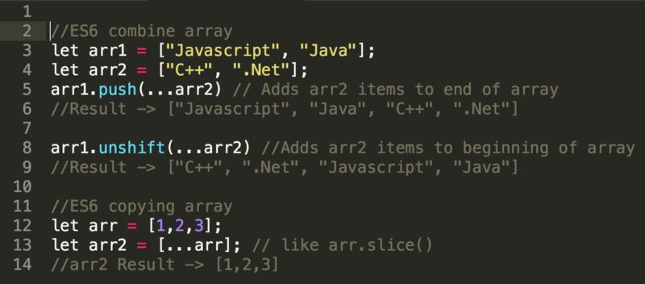
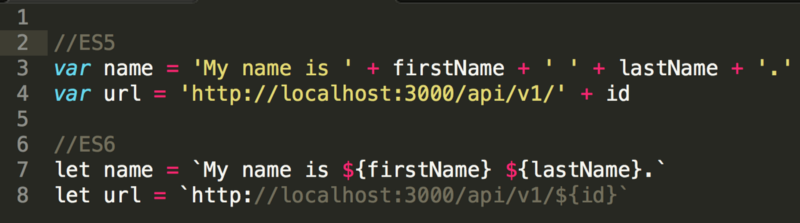
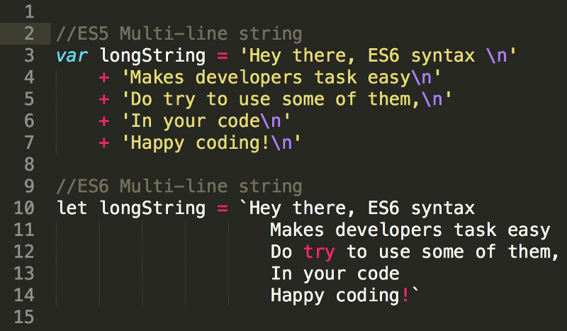

> Here’s the list of the commonly used ES6 features that a Javascript developer must know.

1.  **Arrow Functions  
    **Also know as _fat_ function allows a developer to accomplish the same result with fewer lines of code and approximately half of the typing.These function expressions are best suited for non-method functions, and they cannot be used as constructors.

**2.** **Array Element Finding** Here is some cool trick for developer looking for the easiest way to find some elements in an array. ES6 provides 2 new Array methods _find()_ and _findIndex()_. _find()_ always returns the first element which satisfies the condition mentioned for finding some elements.

In the below example **_find()_** method returns the first element which matches the condition where element is equal to _b._ **_findIndex()_** returns the position where the element is found and returns _\-1_ if it fails to find the given element.

**3\. let and const  
**The difference between `let` and `const` is that once you bind a value/object to a variable using `const`, you can't reassign to that variable.

`let` —use block scope in programming.  
`const` — immutable with variables.

**4\. Promises  
**_Promises_ give us a way to handle asynchronous processing in a more synchronous fashion.

**Creating Promises  
**The standard way to create a Promise is by using the `new Promise` constructor which accepts a handler that is given two functions as parameters. The first handler (_typically named_ `resolve`) is a function to call with the future value when it's ready; and the second handler (_typically named_ `reject`) is a function to call to reject the Promise if it can't resolve the future value.

_Promise_ itself has one of the following three states:

1.  `Pending` - until a Promise is fulfilled it is in pending state
2.  `Fulfilled` - when the first handler is called the Promise is considered fulfilled with the value passed to that handler.
3.  `Rejected` - if the second handler is called, the Promise is considered rejected with the value passed to that handler.

**Consuming Promises  
**A Promise’s `.then()` method actually takes two possible parameters. The first is the function to be called when the Promise is fulfilled and the second is a function to be called if the Promise is rejected.

**5\. Spread Operator  
**spread operator _(…)_ comes to handy when you want to do some quick operations on array like combining, copying, adding element at first/last position of array.

**6\. Template Literals  
**Template literals or interpolation in other languages is a way to output variables in the string. So in ES5 we had to break the string. And in ES6 new syntax `${NAME}` inside of the back-ticked string makes things go easy.

**7\. Multi-line Strings  
**Declaring a multi-line string works like a charm in ES6.

_Thus these were some of the most commonly used ES6 syntax which helps a lot of times to make complex operations easy and consuming less lines in your code.  
To know more about ES6 follow this_ [_link_](http://es6-features.org/)_._

_Happy coding!_ 🖥 😄
