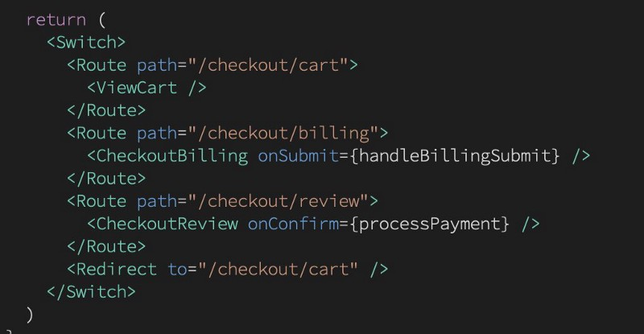
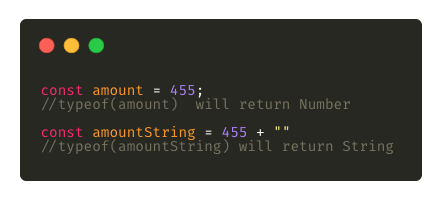
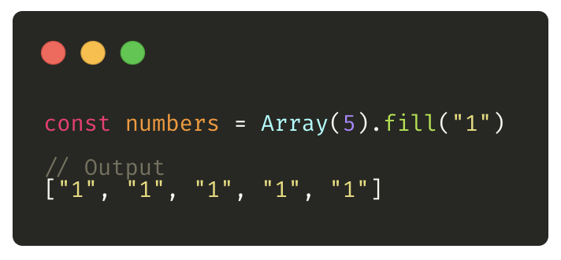
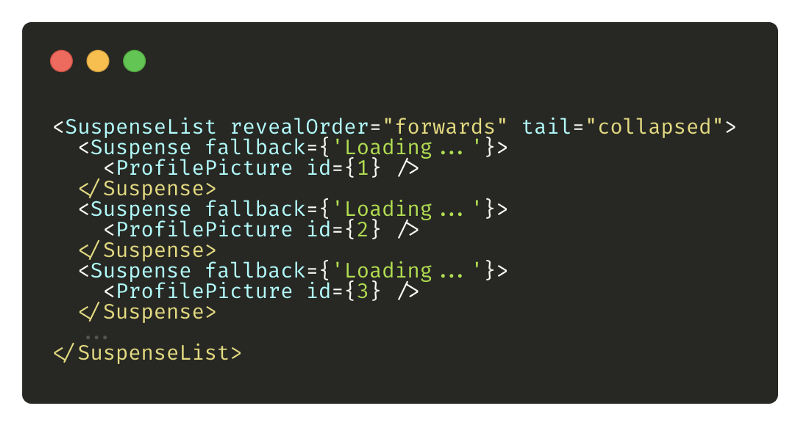
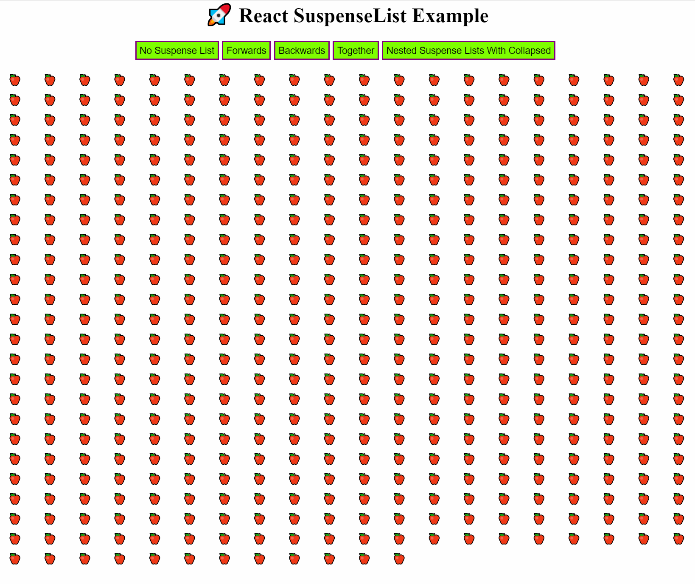
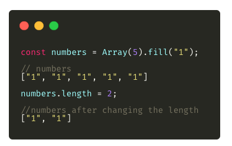

](./asset-1.png)

Every year, there are a ton of different updates on the libraries, frameworks, and technical concepts that we use in our projects. Our goal as a good dev is to make the most of the new features to make our life easy.

Here are some of the small tips which I found useful while working with JavaScript and React, I hope you get to learn something new from this and can implement some of the tips while working with React/JavaScript.

---

### 1\. React Router JSX API

I’m pretty sure everyone out there must be using [React Router](https://reacttraining.com/react-router/) to maintain different routes within the application. But wait, did you know how to pass props to the route component?

Take a look at the below code snippet, instead of passing the component in the route you can pass the entire component with props while defining the route.



Read more:

source — [https://twitter.com/ryanflorence/status/1206643654753783808](https://twitter.com/ryanflorence/status/1206643654753783808)

---

### 2\. Lazy Load Images Using Different Libraries

Did you know that with Chrome’s 76 version, it is now possible to lazy load the images without including _any_ third-party libraries? Simply add the `loading` attribute to lazy-load resources.

Take a look at the below snippet:

```

```

Read more:

[**Native lazy-loading for the web**  
_This post covers the loading attribute and how it can be used to control the loading of images and iframes._web.dev](https://web.dev/native-lazy-loading/ "https://web.dev/native-lazy-loading/")[](https://web.dev/native-lazy-loading/)

---

### 3\. Convert Number to String

Wondering which is the faster and easier way to convert a number to a string?



This hack will automatically convert any number type into a string.

---

### 4\. Fill Array

While defining an array, if you want to fill it with some data then it’s pretty easy.

Just define the size of the array along with the property that you want to fill in. This is a simple trick that comes in handy when you want to define a non-empty array.



---

### 5\. Proper Data Structure for Fast Access to Data

Did you know that storing your data in an array of an object is much slower when compared to using object keys (usually ID) as the key in the data structure?

It does not require any iteration, you will be able to fetch any record of your choice.

source — [https://twitter.com/tejaskumar\_/status/1209187101432004608?s=21](https://twitter.com/tejaskumar_/status/1209187101432004608?s=21)

---

### 6\. Optional Chaining

Optional chaining in JavaScript really makes the developer’s job easy. This operator allows you to traverse through a nested object to get the value of variables without worrying if any of those will be undefined.

Let’s consider an example to get more of an idea about this:

```
const person = {  
  name: 'John Doe',  
  device: {  
    name: 'iPhone 11 Pro'  
  }  
};
```

Consider we have an object called `person`, now if I want to access the device name, the simple syntax would be something like:

```
const deviceName = person.device.name;
```

If `device` is undefined or null in `person`, the JavaScript interpreter will throw an error. With the optional chaining operator, you can write:

```
const deviceName = person?.device?.name;
```

If `deviceName` is undefined, the `deviceName` will be `null`. Thus, by using optional chaining if the property in the object isn’t present, you don’t have to handle it explicitly. Optional chaining is here to rescue you.

---

### 7\. Use of SuspenseList

React 16.6 added `<Suspense>`, a component that lets you “wait” for some code to load and declaratively specify a loading state (like a spinner) while waiting.

Here’s a quick glimpse of what the code looks like:



`SuspenseList` takes two props:

-   `**revealOrder**` (forward, backward, together) defines the order in which the `SuspenseList` children should be revealed.
-   `together` reveals _all_ of them when they’re ready, instead of one-by-one.
-   `**tail**` (collapsed, hidden) dictates how unloaded items in a `SuspenseList` are shown.
-   By default, `SuspenseList` will show all fallbacks on the list.
-   `collapsed` shows only the next fallback on the list.
-   `hidden` doesn’t show any unloaded items.

In short, `SuspenseList` can be used to load items, one at a time, in a defined order, or all together — for better user experience.

We can wrap multiple `<Suspense/>` inside the `<SuspenseList/>` Tag.

Example:



Example repo link:

[**Harshmakadia/react-suspenseList**  
_Demo example for suspense list ⚠️ SuspenseList is experimental feature that are not yet available in a stable release…_github.com](https://github.com/Harshmakadia/react-suspenseList "https://github.com/Harshmakadia/react-suspenseList")[](https://github.com/Harshmakadia/react-suspenseList)

> **Note**: This is experimental features that are [not yet available](https://reactjs.org/docs/concurrent-mode-adoption.html) in a stable release.

---

### 8\. Add Dynamic Object Properties

While defining an object, there might be a situation where you need to define the object properties dynamically. Let’s look at the example below.

---

### 9\. Switching to CRA 2.0 From CRA 1.0

Wondering why?

source — [https://twitter.com/reactjs/status/1046933146736963587?s=20](https://twitter.com/reactjs/status/1046933146736963587?s=20)

---

### 10\. Reducing the Length of an Array

Most of you might know this simple trick to reduce the array length. All you need to do is assign it a number to a specific number.



---

### 11\. styled-components

[Styled-components](https://www.styled-components.com/) effectively belong to the CSS-in-JS libraries that abstract the CSS to the component level using only JavaScript to describe styles.

They can be created via the ES6 template literal notation using back-ticks like so:

---

### 12\. Cache Busting a React App

Have you ever come across a scenario where the new build is not updated on the single-page refresh or requires clear caching to reflect the new changes?

[This amazing blog](https://dev.to/flexdinesh/cache-busting-a-react-app-22lk) explains how to handle versioning in React.

[**Cache Busting a React App**  
_TL;DR - SemVer your app and generate a meta.json file on each build that won't be cached by the browser. Invalidate…_dev.to](https://dev.to/flexdinesh/cache-busting-a-react-app-22lk "https://dev.to/flexdinesh/cache-busting-a-react-app-22lk")[](https://dev.to/flexdinesh/cache-busting-a-react-app-22lk)

Below are some tips to consider, they have nothing to do with the logic but they help make your job easy.

---

### 13\. Create Presentations With React

React [MDX-based presentation decks](https://mdx-deck.jxnblk.com).

[Reveal.js](https://revealjs.com/#/) is another library that can be used to develop catchy presentations. It’s an HTML presentation framework.

---

### 14\. Documentation With Docz

Docz enables you to quickly create live-reloading, SEO-friendly, production-ready documentation sites with MDX and customize the look, feel, and behavior when required by leveraging [GatsbyJS](https://www.gatsbyjs.org/) and Gatsby theme shadowing.

[**Docz**  
_It has never been so easy to document your things_www.docz.site](https://www.docz.site/ "https://www.docz.site/")[](https://www.docz.site/)

---

### 15\. Free Images and Illustrations

A collection of links for free stock photography, video, and illustration websites.

[**neutraltone/awesome-stock-resources**  
_A curated list of awesome stock photography, video and illustration websites. I try my best to maintain this repository…_github.com](https://github.com/neutraltone/awesome-stock-resources "https://github.com/neutraltone/awesome-stock-resources")[](https://github.com/neutraltone/awesome-stock-resources)

Thanks for reading. These were some of the tips and tricks that I use in my day-to-day tasks.

Happy learning.
