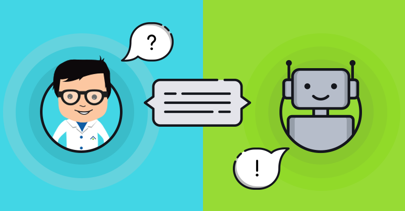

Wondering what’s bots era?

Application of chatbots rages wide from being your sales rep, booking a restaurant or your favourite movie running in theatre to answering customer queries. Chatbots can conduct conversations via auditory or textual methods. The good thing about them is they can function independently improving your business or get works done via integrations like facebook messenger, slack, skype and lot more.

Chatbots offer a customer a convenient way to get the information they need, help them in boosting the sales and due to there ease of use. Let’s look at some of the areas where chatbot has helped in growing the business in different sectors.

### E-commerce

> Chatbots are very useful in e-commerce helping brands to relate more quickly and directly with their customers on numerous messaging platforms.

-   Chatbots can become your advisor in buying the product online for better customer satisfaction.
-   Suggest products based on customer intents and browsing history.
-   Share information about the new products and offers via a simple message which can be sent out using any messaging platform to stay connected with the customers.

### Hospitality and Travel

> Chatbots and service industries can go hand in hand to solve customer queries by saving time and providing a personalised experience to the customers.

-   Helps staff to focus on the critical and rewarding task by answering the frequently asked questions by the customers.
-   Chatbots can communicate in different languages and thus provide a personalized experience to the guests.
-   Ordering food has become easier like never before selecting options from a wide list of menu and filing in the delivery address can be done just by making minimal clicks on your smartphones.

### Call Centers

> [Recent studies](https://www.businesswire.com/news/home/20140402005509/en/52-Percent-Consumers-Prefer-Text-Conversations-Support) show 52 Percent Of Consumers Prefer Text Conversations with Support Reps Over Their Current Support Method.

-   Chatbots can be made run 24 X 7 to have seamless interaction with the customer and also answer queries about multiple customers, unlike the human agent.
-   Gather information about the leads before it handovers to the human agent.
-   Customers get an instant response for their queries rather than waiting in queue to talk to the human agent. Human interaction might take hours or even days to resolve queries which can be done in the fraction of seconds with chatbots.

### Finance Assistant

> Consumers will manage their 85% of the relationships with the enterprise without interacting with a human by 2020 according to this report by [Gartner](https://www.gartner.com/imagesrv/summits/docs/na/customer-360/C360_2011_brochure_FINAL.pdf).

-   Customers can manage multiple bank accounts and get there bank balance having the conversation with the finance bot anytime when needed.
-   Eliminate use to third-party apps to make payment and other transactions instead why not just chat with the bot?

### Healthcare

> Grand View Research stipulates that the global chatbot market is estimated to touch at least [$1.23 billion by 2025](https://www.grandviewresearch.com/info/about-us) which reflects a compounded annual growth rate (CAGR) of 24.3%.

-   Patients can get quick and effective medical advice remotely with the need of booking an appointment.
-   Medical chatbots can be programmed to handle the patient’s admission and discharge, order medical equipment for patients, renew prescriptions and schedule medical appointments.
-   The patients can ask questions anytime and get an immediate response from the _24 x 7_ running chatbots.

### Wondering where can you get such chatbot which can help you drastically grow your business and boost sales?

### Head to [WotNot.io](https://wotnot.io/#/)

WotNot is a bot making platform that easily integrates with your website and you can fully customize the bot as per your business needs.

Key Advantages of using WotNot.io

1.  **FAST ONBOARDING  
    **Have the Chatbot available on your website just by entering your website URL and start reaping the benefits right away. No time is spent on training or teaching employees.
2.  **READY TO USE TEMPLATES  
    **It provides ready to use default templates to make your work easier and then you can customize it according to your need
3.  **SALES BOOSTER  
    **Capable of remembering customer preferences and uses order history to suggest products, learns from customer responses to the products advertised and cross-sells effectively.
4.  **LEAD GENERATION  
    **The chatbot can ask the necessary and related questions, persuade the user and generate a lead for you. The technology of the Chatbot ensures the flow is in the right direction to get higher conversion rates.
5.  **MULTI LINGUAL  
    **Chatbots can solve your customer care problems in multiple languages round the clock. This allows your business to scale up the operations to new markets while simultaneously personalising the experience for your customers.
6.  **24/7 SUPPORT  
    **Think of it as an unremitting virtual robot committed to delivering a proactive conversational experience from the get go. Round the clock.

---

In conclusion there is no doubt that chatbots 🤖 are on the verge of conquering the world by proving an remarkable customer experience not matter which industry it is.
